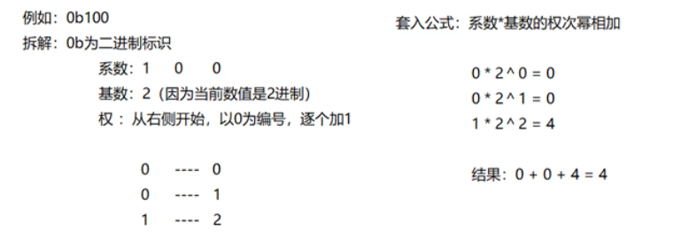
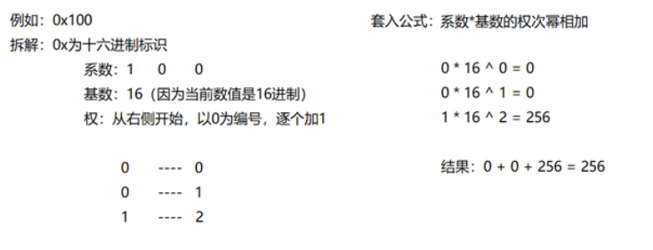

### 1.进制转换

#### 	二进制到十进制的转换:

​		**公式:** 系数 * 基数的权次幂相加

​		系数 :每一位上的数

​		基数:几进制即使几

​		权:从数值的右侧,以0开始,逐个+1增加

#### 十六进制到十进制的转换:

​		**公式:** 系数 * 基数的权次幂相加

​		系数 :每一位上的数

​		基数:几进制即使几

​		权:从数值的右侧,以0开始,逐个+1增加

**总结:**任意进制到十进制的转换

**公式:** 系数 * 基数的权次幂相加