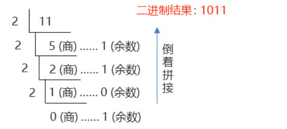
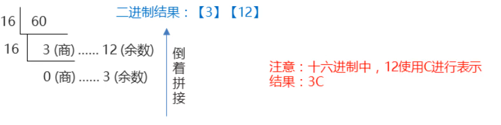

### 1.进制转换

#### 	十进制到二进制的转换

​		**公式:**除基取余

​		使用源数据,不断的除以基数(几进制,基数就是几)得到余数,直到商为0,再将玉树倒着拼起来即可

**需求:**将十进制数字11,转换为2进制

**实现方式:**源数据为11,使用11不断除以基数 , 也就是2 , 直到商为0

#### 十进制到十六进制的转换

​		**公式:**除基取余

​		使用源数据,不断的除以基数(几进制,基数就是几)得到余数,直到商为0,再将玉树倒着拼起来即可

​	**需求:**将十进制数字60,转换为16进制.

​	**实现方式:**源数据为60,使用60不断的除以基数,也就是16,直到商为0.

**总结:**十进制到任意进制的转换

**公式:**除基取余

​		使用源数据,不断的除以基数(几进制,基数就是几)得到余数,直到商为0,再将玉树倒着拼起来即可