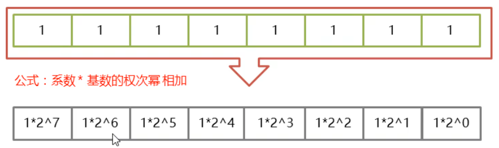
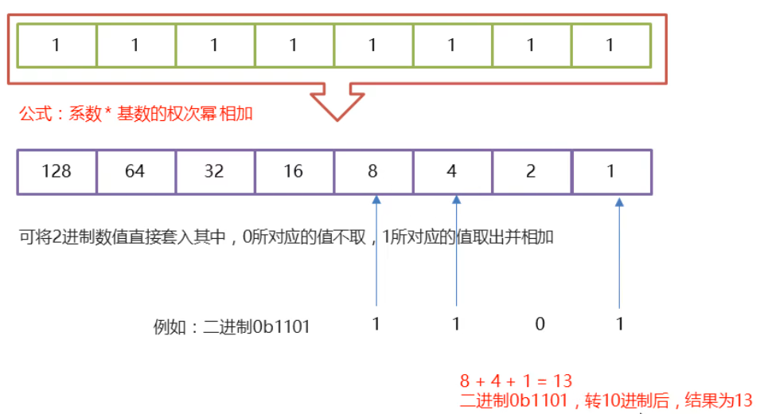
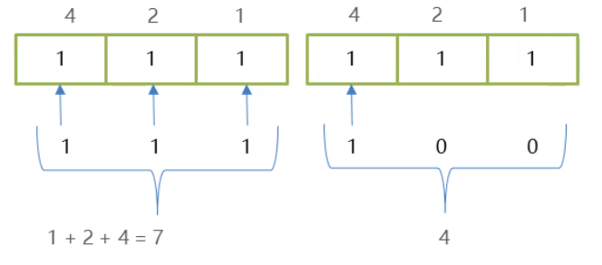
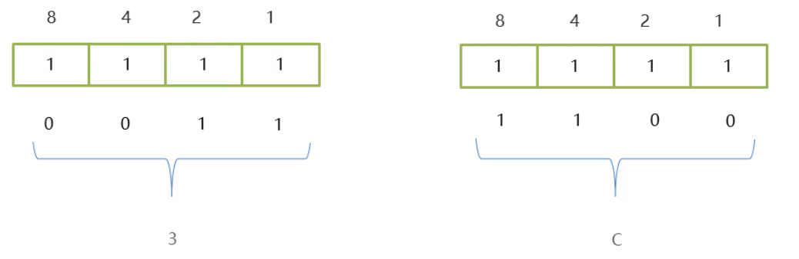

### 1.快速进制转换法

​		**8421码:**又称BCD码,是BCD代码中最常用的一种

​		**BCD:**(Binary-Coded Decimal)二进制码十进制数

​		在这种编码方式中，每一位二进制值的1都是代表一个固定数值，把每一位的1代表的十进制数加起来 得到的结果就是它所代表的十进制数

### 2.二进制快速转十进制

### 3.二进制快速转八进制

**八进制:**将三个二进制位看为一组,再进行转换

**原因:**八进制逢八进一,三个二进制位最多可以表示111,也就是数值7,如果出现第四位,就超出范围了

**需求:**将60的二进制0b111100转换成八进制

### 4.二进制快速转八进制

**十六进制:**将四个二进制位看为一组,再进行转换

**原因:**十六进制逢十六进一,四个二进制位最多可以表示1111,也就是数值15,如果出现第五位,就超范围了

**需求:**将60的二进制0b111100转换为十六进制