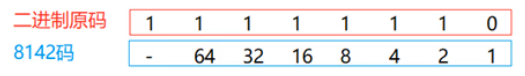

### 1.原码反码补码介绍

​		**注意:**计算机中的数据,都是以二进制补码的形式再运算,而补码则是通过反码和原码推算出来的

**原码:**就是二进制定点表示法,即最高位为符号位,0表示正,1表示负,其余位表示数值的大小

**反码:**正数的反码与其原码相同;负数的反码是对其原码的逐位取反,但符号位除外

**补码:**正数的补码与其原码相同,负数的补码是在其反码的末位加1

**总结:**

​	1.正数的原反补都是相同的

​    2.负数的反码是根据原码取反(0变1,1变0)得到的,(符号位不变)

​    3.负数的补码,是根据(反码)的末尾+1,得到的

**需求:**求-7的补码

​	**原码:**  1(符号位)0000111	------------>	转换成反码  符号位不变,0变1,1变0 

​	**反码:** 11111000				------------->反码末尾+1,求补码

​	**补码:** 11111001


```java
byte b = (byte) 130;
System.out.println(b);
```

1.整数130 : 默认为int,int占用4个字节,也就是4组8个二进制位

00000000 00000000 00000000 10000010

2.强转到byte:4个字节,强制转换为1个字节,就是砍掉前三组8位

10000010	//补码 -->因为补码参与运算

3.根据运算后的补码,反向推原码

​	补码 -- > 反码 末尾 - 1

   10000010

​				   -1

______________________________________________________

 100000001		反码 -> 原码:符号位不变,其他数值逐位取反

__________________________________________________________

 11111110

4.使用8241码开始计算



2 + 4 + 8 + 16 + 32 + 64 = 126

拼上符号位即是 -126


