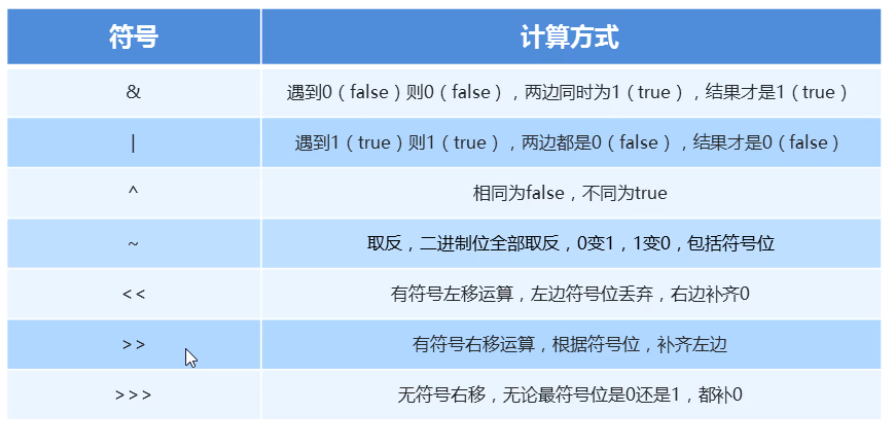

### 1.位运算

​		位运算符指的是二进制的运算,先将十进制数转成二进制后再进行运算 , 在二进制运算中,1表示true,0表示false

**& 位于 :**   遇false则false,遇0则0
**| 位或:** 	遇true则true,遇1则1
**^ 位异或:** 相同为false,不同为true
**~ 取反:**     全部取反,0变1,1变0 (也包括符号位)





```java
public static void main(String[] args) {
    System.out.println(6 & 2);  //-2
    System.out.println(~6);     //-7
}
```

```java
   000000000  000000000  000000000 000000110       //6的二进制
&  000000000  000000000  000000000 000000010       //2的二进制
-----------------------------------------------------------
   000000000  000000000  000000000 000000010       //结果:2
```

```java
    000000000  000000000  000000000 000000110  //6的二进制补码
 ~  111111111  111111111  111111111 111111001
-----------------------------------------------> 补码 -1 得反码
    111111111  111111111  111111111 111111000
 ----------------------------------------------> 反码 取反 的原码
    10000000   000000000  000000000 000000111  // -7
```

```java
<< 有符号左移运算符：二进制位向左移动，左边符号位丢弃，右边补齐0
    运算规律：向左移动几位，就是乘以2的几次幂
    
>>有符号右移运算符：二进制向右移动，使用符号位补位
    运算规律：向左移动几位，就是除以2的几次幂
        00000000  00000000  00000000  00000011    //3的二进制

>>> 无符号右移运算符,无论符号位是0还是1，都补0
    运算规律：
```

```java
public static void main(String[] args) {
    System.out.println(12 << 1);    //24
    System.out.println(12 << 2);    //48

    System.out.println(4 >> 1);     //1
    System.out.println(4 >> 1);     //1
}
```

```java
00000000  00000000  00000000  00001100     //12的二进制
<< 1
---------------------------------------
00000000  00000000  00000000  00011000		 //24
    
00000000  00000000  00000000  00000011    //3的二进制
>> 1
---------------------------------------
00000000  00000000  00000000  00000001		//1
```

**^ 异或运算符特点：**

​	一个数，被另外一个数，异或两次，该数本身不变

​	

```java
public static void main(String[] args) {
    System.out.println(10 ^ 5 ^ 5);    // 10
    System.out.println(10 ^ 5 ^ 10);    // 5
}
```
