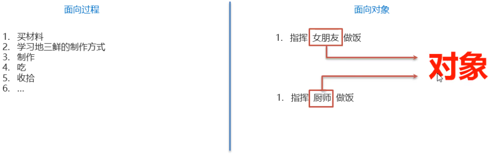
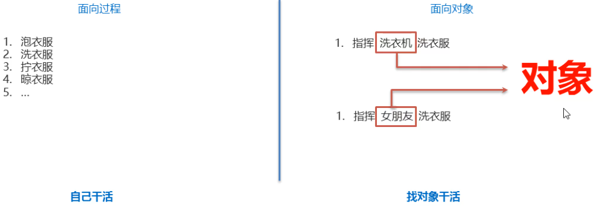

### 1.面向对象和面向过程的思想对比

​	**面向过程编程（Procedure Oriended Programming）:**是一种以过程为中心的编程思想，实现功能的每一步，都是自己实现的

   **面向对象编程（ObjectOriented Programming）:**是一种以对象为中心的编程思想，通过指挥对象实现具体的功能

 **需求：**吃一盘菜（地三鲜）

 

**需求：**洗衣服

#### 对象：指客观存在的事物  万物皆对象

#### 面向对象是基于面向过程演变而来的

#### 面向对象思想小结：

​	1.客观存在的任何一事物，都可以看作为程序中的对象

​	2.使用面向对象思想可以将复杂的问题简单化

​	3.将我们从执行者的位置，变成了指挥者