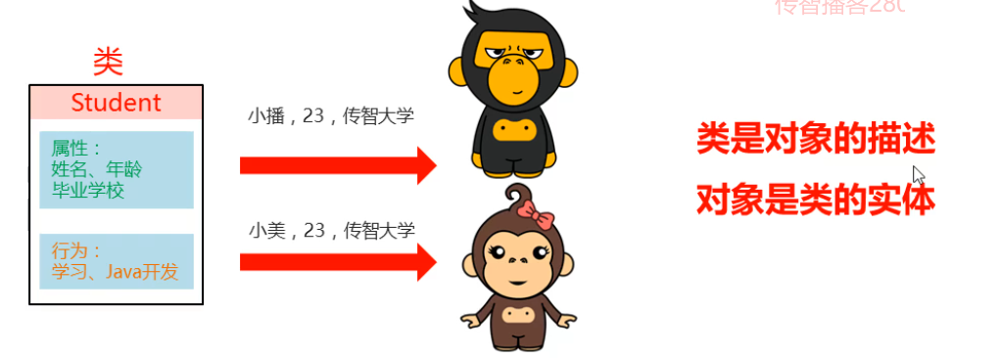

### 1.什么是类

​	类是对现实生活中一类具有共同属性和行为的事物的抽象，类是对事物，也就是对象的一种描述，可以将类理解为一张设计图根据设计图，根据设计图，可以创建除具体存在的事物，也就是根据类去创建对象

### 2.类的组成

**属性：**该事物的各种特征

​		例如：黑马学生事物的属性：姓名、年龄、毕业院校

**行为：**该事物存在的功能（能够做的事情）

​		例如：黑马学生事物行为：学习、Java编程开发

​	

### 3.类和对象的关系

**类：**类是对现实生活中一类具有共同属性和行为的事物的抽象

**对象：**是能够看得到摸得着的真实存在的实体

通过一个类可以创建多个对象！