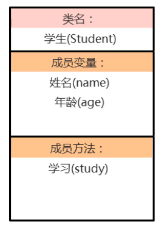

### 1.类的定义

**类的组成：**属性和行为

​	**属性：**在代码中通过成员变量来体现（类中方法外的变量）

​	**行为：**在代码中通过成员方法来体现（和前面的方法想比去掉static关键字即可）

**类的定义步骤：**
	1.定义类

​	2.编写类的成员变量

​	3.编写类的成员方法

```java
public class 类名{
    //成员变量
    变量1的数据类型 变量1;
    变量2的数据类型 变量2;
    ...
    //成员方法
     方法1;
     方法2;
}
```

**需求：**定义一个学生类



```java
package itheima01;
/*
学生类
    属性：名字、年龄
    行为：学习
*/
public class Student {
    //成员变量
    String name;
    int age;
    //成员方法
    public void study(){
        System.out.println("学习");
    }
}
```