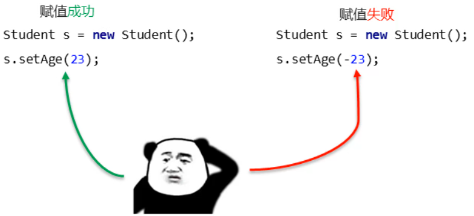
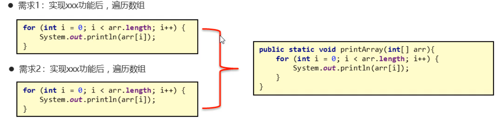
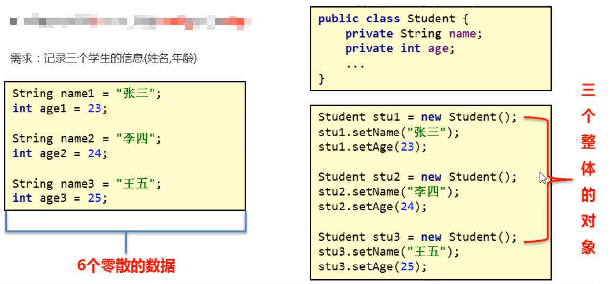

### 1.封装

​		面向对象三大特征之一（**封装、多态、继承**）

​		隐藏实现细节，仅对外暴露公共的访问方式

```java
public class Student {
    //成员变量
    private String name;
    //int age;
    private int age;
    public void setAge(int a){
        if (a > 0 && a <120){
            age = a;
        }else {
            System.out.println("请检查年龄数值");
        }
    }
    
}
```



**问题：**封装指的就是私有嘛？

​	答：私有仅仅是封装的一种体现

### 2.封装常见体现

#### 	1.私有成员变量，提供setXxx()和getXxx()方法

```java
public class Student {
    //成员变量
    private String name;
    //int age;
    private int age;
    public void setAge(int age){
        if (age > 0 && age <120){
            this.age = age;
        }else {
            System.out.println("你输入的年龄不合理");
        }
    }
    public int getAge(){
        return age;
    }
    public void setName(String name){
        this.name = name;
    }
    public String getName(){
        return name;
    }
    public void show(){
        System.out.println(name+"----"+age);
    }
}
```


#### 	2.将代码抽取到方法中，这就是对代码的一种封装



#### 	3..将属性抽取到类当中，这是对数据的一种封装



#### 封装的好处：

​	1.提高了代码的安全性

​	2.提高了代码的复用性