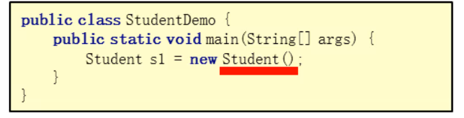

### 1.构造方法概述

​	构建、创造对象的时候、所调用的方法



**格式：**

​	1.方法名与类名相同，大小写也要一致

​	2.没有返回值类型，连void都没有

​	3.没有具体的返回值(不能由return带回结果数据)

```java
package com.itheima5.test;
/*
    学生类
*/
public class Student {
    public Student(){
        System.out.println("我是Student的构造方法");
    }
}
```

```java
package com.itheima5.test;
/*
    学生测试类
*/
public class testStudent {
    public static void main(String[] args) {
        //创建对象
        Student stu1 = new Student();    //我是Student的构造方法
        Student stu2 = new Student();    //我是Student的构造方法
    }
}
```

#### 执行时机：

​	1.创建对象的时候调用，每创建一次对象，就会执行一次构造方法

​	2.不能手动调用构造方法