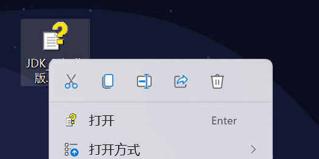
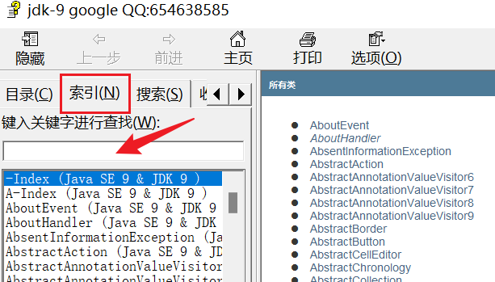
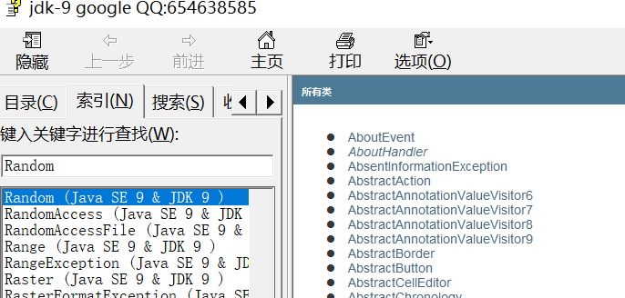
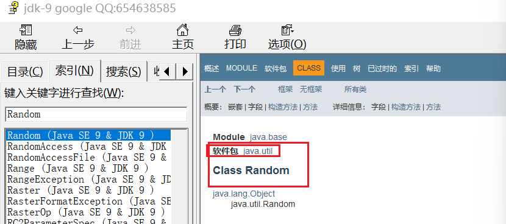
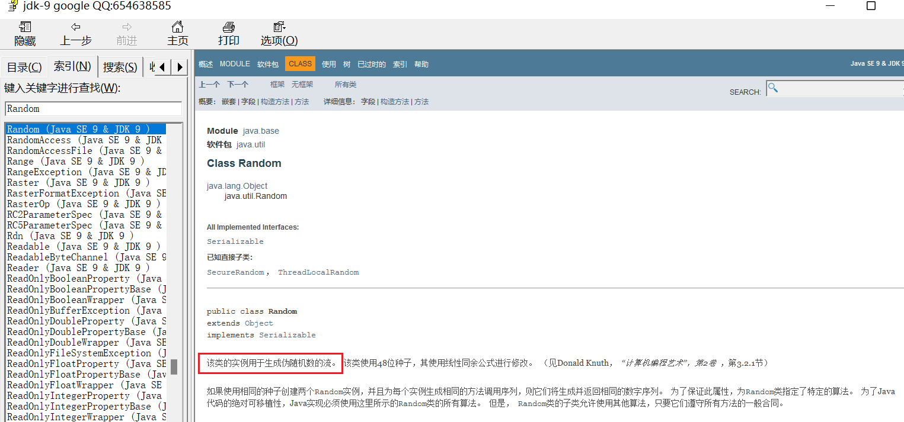
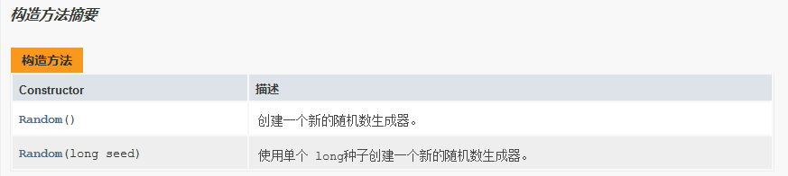

### 1.API概述

​	**API（Application Programming Interface）:**应用程序编程接口

​	**JavaAPI：**指的就是JDK中提供的各种功能的Java类，这些类将底层的实现封装了起来，我们不需要关心这些类是如何实现的，只需要学习这些类如何使用即可，我们可以通过帮助文档来学习这些API如何使用

### 2.如何使用帮助文档

​	1.右键打开该文档

2.找到索引选项卡中的输入框

3.在输入框中输入我们要学习的类的名称

4.看类在那个包下

5.看类的描述

6.看构造方法

7.看成员方法

