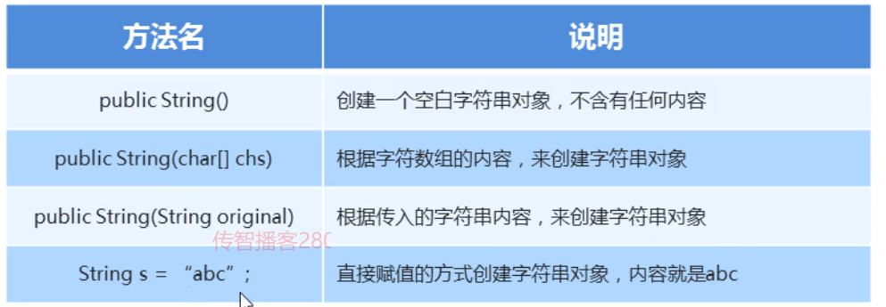

#### 1.String常见构造方法



#### 示例代码：

```java
package com.itheima1.test;

public class Demo02 {
    /*
        String类常见构造方法：
            public String()：创建一个空白字符串对象，不含有任何内容
            public String(char[] chs)：根据字符数组的内容，来创建字符串对象
            public String(String original)：根据传入的字符串内容，来创建字符串对象
            String s = "abc"; 直接赋值的方式创建字符串对象，内容就是abc
                注意：
                    String这个类比较特殊，打印其对象名的时候，不会出现内存地址
                    而是该对象所记录的内容，面向对象-继承，Object类
    */
    public static void main(String[] args) {
        //public String()：创建一个空白字符串对象，不含有任何内容
        String s1 = new String();
        System.out.println(s1);

        //public String(char[] chs)：根据字符数组的内容，来创建字符串对象
        char[] chs = {'a','b','c'};
        String s2 = new String(chs);
        System.out.println(s2);     //abc

        //public String(String original)：根据传入的字符串内容，来创建字符串对象
        String s3 = new String("123");
        System.out.println(s3);     //123
    }
}
```