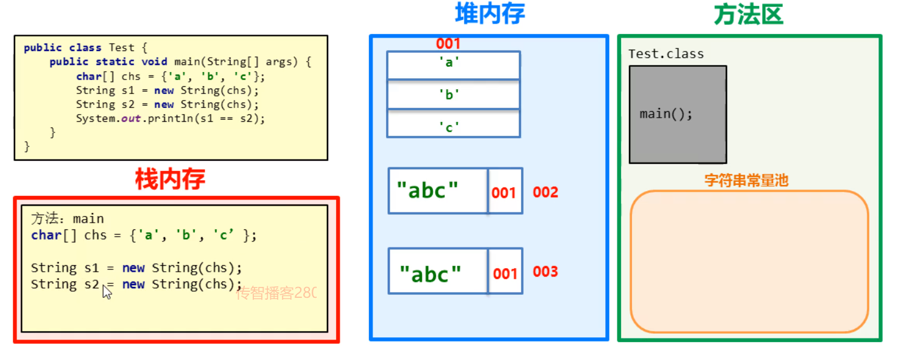

### 1.创建字符串对象的区别

#### 问题：构造方法能创建对象，双引号也能创建字符串对象，有什么区别

```java
String s1 = "abc";
String s2 = "abc";
System.out.println(s1==s2);

char[] chs = {'a','b','c'};
String s3 = new String(chs);
String s4 = new String(chs);
System.out.println(s3==s4);
```


**注意点： ==号作比较**

​			**基本数据类型：**比较的是具体的值

```java
int a = 10;
int b = 20;
System.out.println(a==b)  //false
```

​			**引用数据类型：**比较地址值

```java
Student s1 = new Student(23);
Student s2 = s1;
Syste,.out.println(s1 == s2)  //true
```


以" "方式给出的字符串，只要字符序列相同（顺序和大小写），无论在程序代码中出现几次，JVM都只会建立一个String对象，并在字符串常量池中维护

```java
String s1 = "abc";
String s2 = "abc";
```

**字符串常量池：**当使用双引号创建字符串对象的时候，系统会检查该字符串是否在字符串常量池中存在，

**不存在：创建。**

**存在：不会重新创建，而是直接复用。**


通过new创建出来的字符串对象，每一次new都会申请一个内存空间，虽然内容相同，但是地址值不同

```java
char[] chs = {'a','b','c'};
String s3 = new String(chs);
String s4 = new String(chs);
```

上面的代码中，JVM会首先创建一个字符数组，然后每new的时候都会有一个新的地址


```java
String s1 = "abc";
String s2 = "abc";
System.out.println(s1==s2);		//--->true

char[] chs = {'a','b','c'};
String s3 = new String(chs);
String s4 = new String(chs);
System.out.println(s3==s4);		//--->false
```

#### 结论：双引号创建的字符串对象，在字符常量池中存储，通过构造方法创建的字符串对象，在堆内存中存储