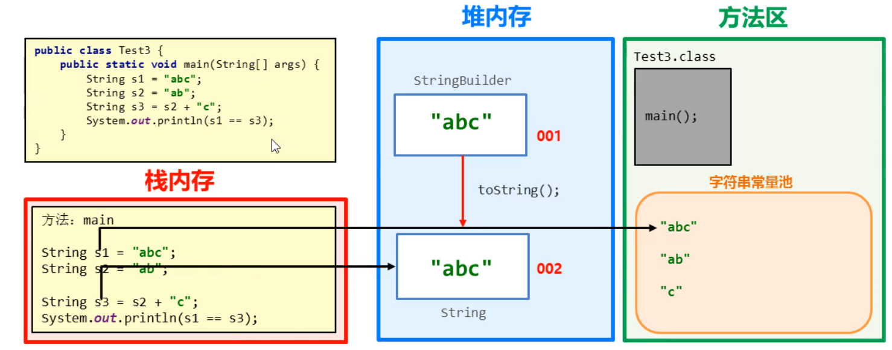

### 1.String字符串的特点

​	Java程序中所有双引号字符串，都是String类的对象。

​	字符串不可变，它们的值在创建之后不能被更改

​	虽然String的值不可变，但是他们可以被共享

### 2.String常见面试题

```java
String s1 = "abc";
String s2 = "abc";
System.out.println(s1 == s2)		//true
```

```java
String s1 = "abc";
String s2 = new String("abc");
System.out.println(s1 == s2)		//false
```

```java
String s1 = "abc";
String s2 = "ab";
String s3 = s2+"c";
System.out.println(s1 == s3)	//false
```



```java
String s1 = "abc";
String s2 = "a"+"b"+"c"; //  --》"abc"
System.out.println(s1 == s2)    //true
```

##### Java存在常量优化机制，在编译的时候，就会将"a"+"b"+"c" 拼接为"abc"
