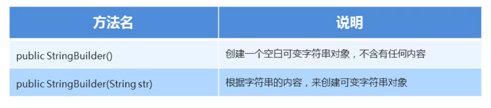

### 1.StringBuilder构造方法



#### 示例代码：

```java
package com.itheima1.stringbuilder;

public class Demo2StringBuilder {
    public static void main(String[] args) {
        /*
            StringBuilder:可变字符串，可以看作为一个容器

            构造方法：
                public StringBuilder():创建一个空白可变字符串对象，不含有任何内容
                public StringBuilder(String str):根据字符串的内容，来创建可变字符串对象
        */
        //public StringBuilder():创建一个空白可变字符串对象，不含有任何内容
        StringBuilder sb = new StringBuilder();
        System.out.println(sb);
        //public StringBuilder(String str):根据字符串的内容，来创建可变字符串对象
        String str = "helloworld";
        StringBuilder sb2 = new StringBuilder(str);
        System.out.println(sb2);    //helloworld
    }
}
```