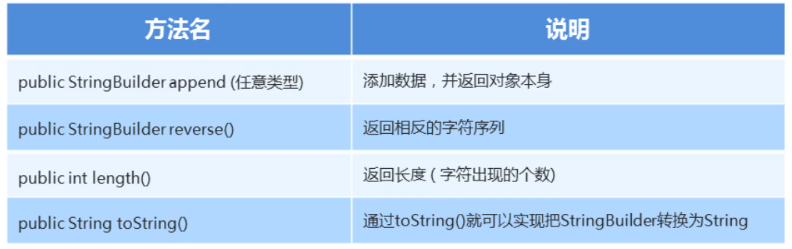

### 1.StringBuilder的常用方法



#### 示例代码：

```java
package com.itheima1.stringbuilder;

public class Demo3StingBuilder {
    public static void main(String[] args) {
        /*
            成员方法：
                public StringBuilder append(任意类型):添加数据，并返回对象本身
                public StringBuilder revese():返回相反的字符序列
                public int length():返回长度（字符出现的个数）
                public String toString():通过toSting()就可以实现StringBuilder转换为String
        */
        StringBuilder sb = new StringBuilder();
        /*
            sb.append("红色");
            System.out.println(sb); //红色
            sb.append("绿色");
            System.out.println(sb); //红色绿色
            sb.append("蓝色");
            System.out.println(sb); //红色绿色蓝色
        */
        /*
            StringBuilder sb2 = sb.append("绿色");
            StringBuilder sb3 = sb2.append("红色");
            sb3.append("蓝色");
            System.out.println(sb2);    //绿色红色蓝色
            System.out.println(sb3);    //绿色红色蓝色
            System.out.println(sb == sb2);  //true
            System.out.println(sb2 == sb3); //true
        */
        //链式编程：如果一个方法返回的是对象类型，对象就可以继续向下调用方法。
        sb.append("红色").append("蓝色").append("绿色");

        // public StringBuilder revese():返回相反的字符序列
        System.out.println("反转前："+sb);  //反转前：红色蓝色绿色
        sb.reverse();
        System.out.println("反转后："+sb);  //反转后：色绿色蓝色红

        //public int length():返回长度（字符出现的个数）
        System.out.println("sb中字符的个数为："+sb.length());   //sb中字符的个数为：6

        //public String toString():通过toSting()就可以实现StringBuilder转换为String
        String str = sb.toString();
        System.out.println(str);    //色绿色蓝色红
        
    }
}
```