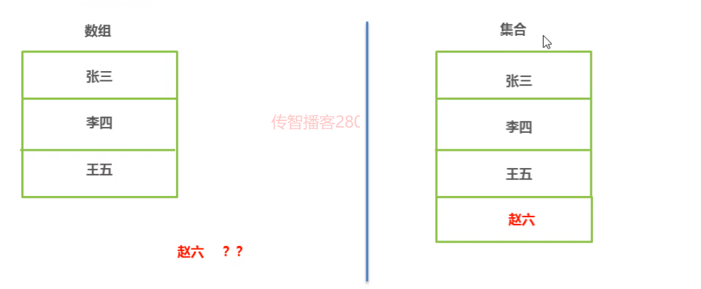

### 1.对象数组

##### 需求：将(张三,23)(李四,24)(王五,25)封装为3个对象并存入数组随后遍历数组，将学生信息输出在控制台

**思路：**
    1.定义学生类准备用于封装数据
    2.动态初始化长度为3的数组，类型为Student类型
    3.根据需求创建3个学生对象
    4.将学生对象存入数组
    5.遍历数组，取出每一个学生对象
    6.调用对象的getXxx方法获取学生信息，并输出在控制台

#### 示例代码：

```java
package com.heima.domain;
/*
    学生类
*/
public class Student {
    //成员变量
    private String name;
    private int age;

    //构造方法
    public Student(){}
    public Student(String name,int age){
        this.name = name;
        this.age = age;
    }
    //成员方法
    public void setName(String name){
        this.name = name;
    }
    public String getName(){
        return name;
    }
    public void setAge(int age){
        this.age = age;
    }
    public int getAge(){
        return age;
    }
}
```

```java
package com.heima.array;

import com.heima.domain.Student;    //导包  类所在的路径

/*
    学生测试类
*/
public class testObjectArray {
    /*
        需求：将(张三,23)(李四,24)(王五,25)封装为3个对象并存入数组
            随后遍历数组，将学生信息输出在控制台
        思路：
            1.定义学生类准备用于封装数据
            2.动态初始化长度为3的数组，类型为Student类型
            3.根据需求创建3个学生对象
            4.将学生对象存入数组
            5.遍历数组，取出每一个学生对象
            6.调用对象的getXxx方法获取学生信息，并输出在控制台
     */
    public static void main(String[] args) {
        // 2.动态初始化长度为3的数组，类型为Student类型
        Student[] arr = new Student[3];
        // 3.根据需求创建3个学生对象
        Student stu1 = new Student("张三",23);
        Student stu2 = new Student("李四",24);
        Student stu3 = new Student("王五",25);
        //4.将学生对象存入数组
        arr[0] = stu1;
        arr[1] = stu2;
        arr[2] = stu3;
        // 5.遍历数组，取出每一个学生对象
        for (int i = 0; i < arr.length; i++) {
            //6.调用对象的getXxx方法获取学生信息，并输出在控制台
            System.out.println(arr[i].getName()+"-----"+arr[i].getAge());
        }
    }
}
```

#### 场景：某学生管理系统需要记录学生信息



### 2.集合和数组的特点对比

**集合类的特点：**提供一种存储空间可变的存储模型，存储的数据容量可以发生改变

**集合和数组的区别：**

​		**共同点：**都是存储数据的容量

​		**不同点：**数组的容量是固定的，集合的容量是可变的


**注意点：**如果存储的数据，长度经常发生改变，推荐使用集合