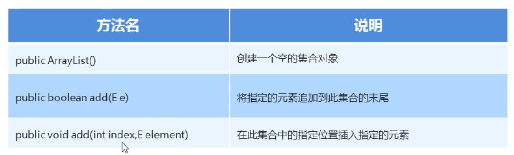

### 1.ArrayList构造方法和添加方法

**注意点：**
   	集合容器如果没有加入<E> 就可以存储任意数据类型
   	<E>泛型：对集合容器存储的数据类型进行限制

使用方法：在出现E的地方我们使用引用数据类型替换即可

​				举例：ArrayList<String>,ArrayList<Student>

#### 示例代码：

```java
package com.heima.list;

import java.util.ArrayList;

public class Demo1ArrList {
    /*
        ArrayList构造方法：
            ArrayList() 构造一个初始容量为10的空列表
        成员方法：
            添加：
                boolean add(E e) 将指定的元素添加到此列表的尾部
                void add(int index,E element) 将指定的元素插入此列表中的指定位置
    */
    public static void main(String[] args) {
        //1.创建集合容器对象
        ArrayList<String> list = new ArrayList<>();
        //2.调用对象的add方法，像容器添加数据
        list.add("111");
        list.add("222");
        list.add("333");
        list.add("444");
        System.out.println(list);

        list.add(2,"000");
        System.out.println(list);
    }
}
```