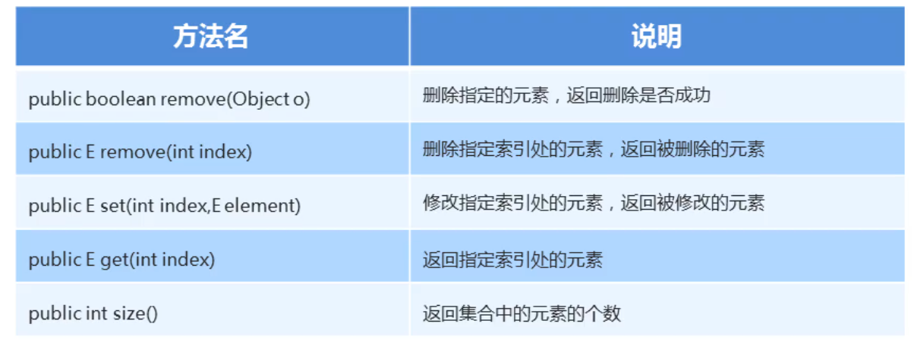

### 1.ArrayList集合常用方法



#### 示例代码:

```java
package com.heima.list;

import java.util.ArrayList;

public class Demo2ArrayList {

    public static void main(String[] args) {
        ArrayList<String> list = new ArrayList<>();
        //添加
        list.add("111");
        list.add("222");
        list.add("333");
        System.out.println(list);
        list.add(0,"666");
        System.out.println(list);
        //删除
        boolean flag = list.remove("666");
        System.out.println(flag);
        String str = list.remove(0);
        System.out.println(str);
        System.out.println(list);
        //修改
        String str1 = list.set(1,"777");
        System.out.println(list);
        //查询
        String str2 = list.get(0);
        System.out.println(str2);
        int count = list.size();
        System.out.println(count);
    }
}
```