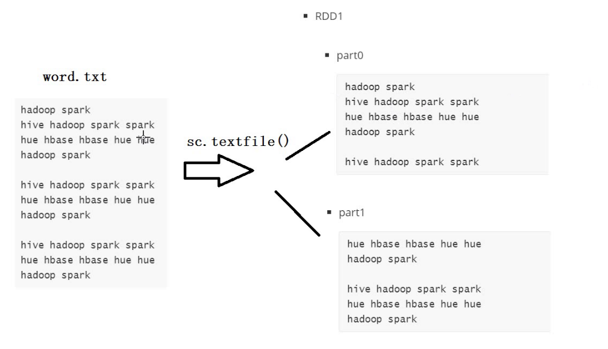

## Python高阶函数

==前言==

Python高阶函数介绍：

- **Lambda表达式/Lambda函数**

  - 功能：用于定义一个没有名字的函数，也叫作匿名函数

  - 对比：正常函数

    ```
    def 函数名(参数):
    	处理逻辑或者返回值
    ```

    ```python
    def add_one(x):
        return x + 1
    
    def print_add_one(x):
        print(x + 1)
    
    
    def add_num_2(x, y):
        x = x + 1
        y = y + 1
        return x + y
    
    
    rs1 = add_one(5)
    print(rs1)
    
    print_add_one(5)
    
    rs3 = add_num_2(1, 3)
    print(rs3)
    ```

  - 语法

    ```
    lambda 参数: 处理逻辑/返回值
    ```

    ```python
    lambda x: x + 1
    
    lambda x: print(x + 1)
    
    lambda x, y: x+1+y+1
    ```

  - 场景：一般搭配高阶函数使用

- **高阶函数**

  - 定义：如果一个函数A，它的某个参数是一个函数B，那么我们称A这个函数就为高阶函数

  - 优点：在一个函数中可以根据用户的需求自定义实现对应的逻辑，避免构建多个函数逻辑

  - 语法

    ```
    def funcA( funcB: T => U, x: int, y: str……)
    ```

  - 举个栗子

    ```python
    list1 = [1, 2, 3, 4, 5, 6, 7, 8, 9, 10]
    
    
    def comp(x):
        return x*x
    
    # 第一个参数是一个函数，第二个参数要处理的列表
    rs = map(comp, list1)
    
    print(*rs)
    ```

  - 使用lambda函数代替

    ```python
    list1 = [1, 2, 3, 4, 5, 6, 7, 8, 9, 10]
    rs = map(lambda x: x*x, list1)
    print(*rs)
    ```

- **总结**：理解高阶函数及Lambda表达式

## 1. map

- **目标**：**理解常用高阶函数map**

- **实施**

  - **功能**：对列表中的元素实现一对一的转换处理，返回得到一个新的列表

  - **场景**：一对一的转换，当遇到对可迭代数据中的每一个数据进行处理的时候就用map

  - **语法**

    ```python
    """
    map(func, iterable)：
    * func：传入一个函数，该函数带有1个形参
    * iterable：可迭代数据，简单理解为一个列表数据
    作用：将可迭代数据中的每个元素传递给func函数的形参，func函数的返回值组成新的一组数据
    """
    ```

  - **示例**

    ```python
    # 定义一个列表
    my_li = [1, 3, 9, 6, 8, 10]
    
    # 需求1：将 my_li 中每个元素加1
    res = map(lambda x: x+1, my_li)
    print(*res)
    
    # 需求2：将my_li 中每个元素都乘2
    def add1(x):
        return x*2
    
    res = map(lambda x: add1(x), my_li)
    print(*res)
    ```

- 图解


## 2. filter

- **目标**：**理解常用高阶函数filter**

- **实施**

  - **功能**：用于实现对列表中的元素进行过滤，满足条件的数据将保留组成新的列表

  - **场景**：数据过滤

  - **语法**

    ```python
    """
    filter(func, iterable)
    * func：传入一个函数，该函数带有1个形参，并且返回一个bool值
    * iterable：可迭代数据，简单理解为一个列表数据
    作用：将可迭代数据中的每个元素传递给func函数的形参，结果为True的数据会被保留，为False的数据会被删除。
    """
    ```

  - **示例**

    ```python
    # 需求1：将 my_li 中大于5的数字保留
    res = filter(lambda x: x > 5, my_li)
    print(*res)
    
    # 需求2：将 my_li 中的奇数保留
    res = filter(lambda x: x % 2 != 0, my_li)
    print(*res)
    ```

- 图解


## 3. reduce

- **目标**：**理解常用高阶函数reduce**

- **实施**

  - **功能**：对列表中的数据进行聚合，返回聚合的结果

  - **场景**：数据聚合

  - **语法**

    ```python
    """
    reduce(func, iterable)：
    * func：传入一个函数，该函数带有2个形参
    * iterable：可迭代数据，简单理解为一个列表数据
    作用：首先将可迭代数据中的前两个元素传递给func函数的两个形参，计算之后，
    func函数的返回值继续和下一个元素传递给func函数的两个形参，继续依次计算直到得到最终结果
    """
    ```

  - **示例**

    ```python
    from functools import reduce
    # 计算 my_li 中元素之和
    res = reduce(lambda tmp,item: tmp+item, my_li)
    print(res)
    
    # 计算 my_li 中元素之积
    res = reduce(lambda tmp,item: tmp*item, my_li)
    print(res)
    ```

- tmp是每一次计算的结果，所以第一次刚进来的时候，tmp为0


**另外一种减法**


## 4. sorted

- **目标**：**理解常用高阶函数sorted**

- **实施**

  - **功能**：对列表中的元素进行排序

  - **场景**：数据排序

  - **语法**

    ```python
    """
    sorted(iterable, key, reverse=False)
    * iterable：可迭代数据，简单理解为一个列表数据
    * reverse：默认为False，设置为True，表示逆序
    * key：传入一个函数，该函数带有1个形参
    作用：对可迭代数据进行排序
    """
    ```

  - **示例**

    ```python
    # 对 my_li 进行降序排序
    sorted(my_li, reverse=True)
    
    # 对 my_word 按照value进行升序排序
    my_word = [('spark', 3), ('pandas', 1), ('hello', 2)]
    sorted(my_word, key=lambda x: x[1], reverse=False)
    ```


## 5. Rdd

分布式的数据集合

spark的计算大致粗略示意图


都是将函数作用于集合中的每一个函数，不过普通的是直接作用于每个元素，而rdd的是先作用于每个分区，再

作用于每个元素

==wordcount案例分析==

step1：读取数据文件，创建rdd分布式数据集

==读取方式：按行读取 ==> 每一行等于一个元素==



step2：过滤每个分区内的数据，去除空格，去空行等，利用strip , len，filter，map函数实现

> ---------------------------------------------------------------------------------------------------------------------------------------------------

==疑问==

为什么要去除每行中头尾的空格？

**代码**


**运行结果**


如上图所示，如果不进行字符串头尾的空格去除，那么在使用split函数以空格为切割符以后，会发现多了两个元

素，这是因为split也对头尾的两个空格进行了切割，所以就多了两个元素头尾

**进行去空格**

```python
str1 = ' adc b n mm '
list1 = str1.strip().split(" ")
print(list1)
```

**结果**


综上：头尾空格会影响我们统计的结果

> ---------------------------------------------------------------------------------------------------------------------------------------------------

==map函数能实现让函数作用于可迭代的数据的每一个元素==

过滤掉空行，使用filter函数进行过滤，产生了新的分布式结果集


接着使用map高阶函数，让split函数作用于可迭代数据集的每一个元素，即这里的每一行


在这里进行切割后其实不是长这样竖着的，因为传进去的元素是一行一行的，所以切割完以后返回来的也是一行，

只不过，原来是字符串，现在是元素是字符串的列表了

原来rdd就是分布式的集合，现在一切，里面也是个集合，相当于现在变成了集合套集合 ==> [[],[],[]..]

==现在我们要做的事情==

就是将里面的集合，炸开，由单行转成多列

这时候就要使用到==flatMap函数==，这个函数相当于hive中的explode爆炸函数，爆炸的同时还可以使用函数作用于

集合中的每一个元素

> ----------------------------------------------------------------------------------------------------------------------------------------------------

接下来要进行计数，就是要把每个元素标记上一个1

这时候就要用到map函数，将每一个元素映射成二元组的形式


接下来就是shuffer的过程，将不同分区内的相同元素分到一起


## 6. flatten

未作用前的结果图示


作用后的结果图示


## 7. flatMap

作用图示


## 8. reduceByKey


当数据为kv对二元组的时候，会把同一个key自动分到一起，value进行聚合计算