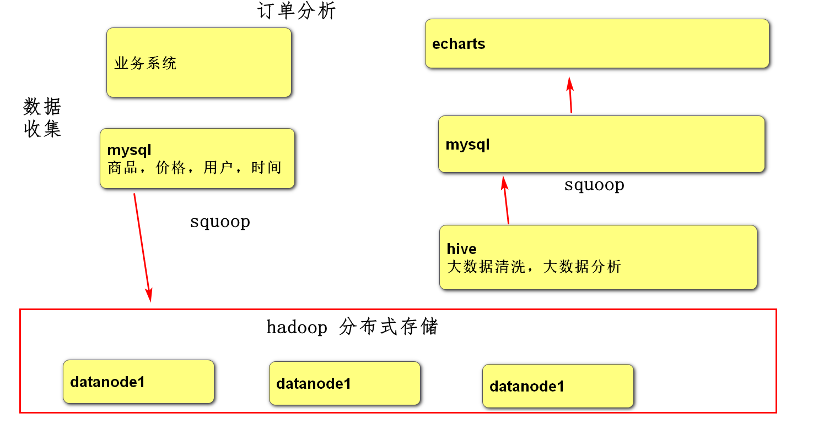

# 1,联系方式

张久军 13691481018


# 2，课程安排

2个项目




第一周：2个项目

第二周：可视化echarts,读mysql

第三周：数据收集，毕设论文内容指导

# 3,hadoop

## 3.1分布式存储


## 3.2 分布式计算


# 4,hive


# 4，用户分析

## 4.1立项

所有网站中用户是重要的。

分析用户的性别

## 4.2需求分析


## 4.3架构分析


## 4.4数据收集

### 4.4.1 sqlyog连接数据库

1，加载linux虚拟机

2，vmware启动linux虚拟机

3，mobaxTerm连接虚拟机

### 4.4.2 建库

### 4.4.3建表

### 4.4.4添加数据

### 4.4.5mysql与hadoop区别

业务系统(网站，app)的数据放在mysql中，添加一行，修改一行

当要进行统计分析时，把数据放到hadoop中，不适用于添加一行，修改一行

## 4.5hadoop分布式存储

4.5.1 启动hadoop

```sh
type start-all.sh

start-all.sh 

type java

java -version 

type jps

jps –l

hadoop fs -ls /
```

用浏览器访问 http://192.168.65.161:50070能访问成功，但是下截文件失败。

以管理员身份运行switchHosts.exe 增加192.168.65.161 hadoop01

### 4.5.2 在hive中创建数据库

才能把mysql数据导过来

```sh
cd /home/app/apache-hive-2.3.6-bin/bin

ls

./hive

hive> create database mall;
hive> show databases;


```


### 4.5.3把mysql中的数据导入到hadoop中


## 4.6hive数据清洗，数据统计

## 4.7大数据可视化

# 5总结

## 5.1毕设项目

两个小项目，用户分析，订单

1，立项

   项目解决什么问题

2，需求分析

processon.com 原型图

对列做分析，列来自表 

3，框架设计

数据收集（网站），hadoop分布式存储，hive清洗，统计，可视化

4，数据收集

springboot+ssm,vue+axios

5，数据分布式存储

hadoop

6，数据清洗，统计

hive

7，统计结果可视化

echarts,springboot+ssm

## 5.2毕设论文

类图，时序图，表设计图，大数据