# 1，复习

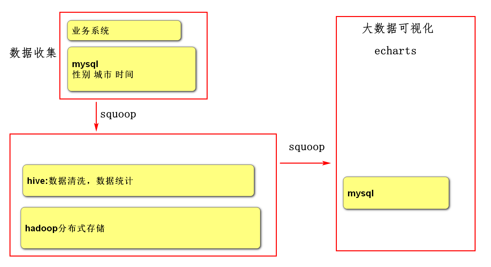

# 2，数据收集

vmware启动虚拟机

启动mobaxterm

start-all.sh

./hive

用squoop导入数据

用hadoop查看数据

```sh
./sqoop import\
 --connect "jdbc:mysql://192.168.65.161:3306/mall?useUnicode=true&characterEncoding=utf-8"\
 --username root\
 --password root\
 --table users\
 -m 1\
 --target-dir '/user/hive/warehouse/mall.db/users'\
 --fields-terminated-by '|';

```

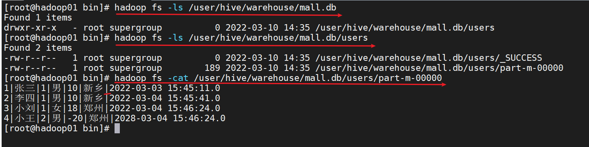

# 3，数据清洗

## 3.1创建users,通过users表来访问/user/hive/warehouse/mall.db/users/part-m-00000

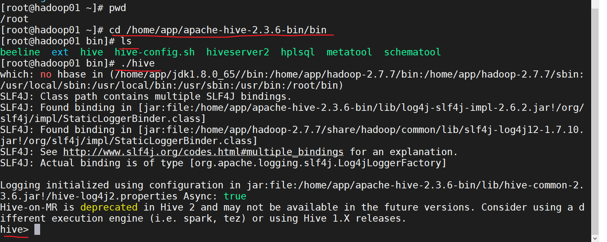

```sql
users表中的数据在/user/hive/warehouse/maill.db/users/
create table users 
(
id bigint,
username string,
password string,
gender string,
age bigint,
city string,
created_time string
)
row format delimited fields terminated by '|';

```

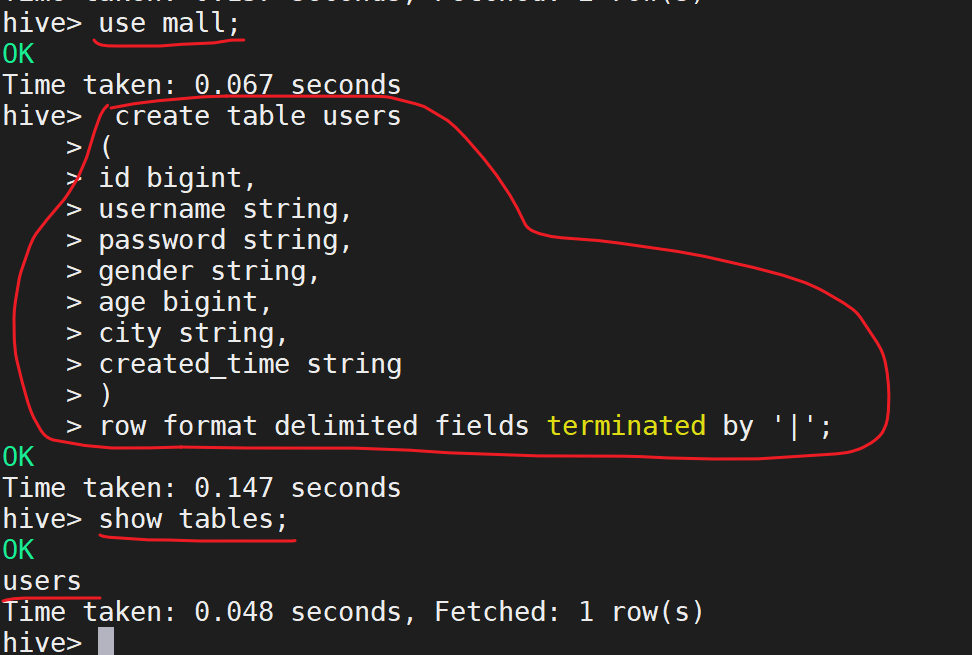

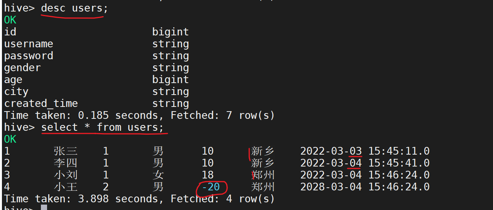


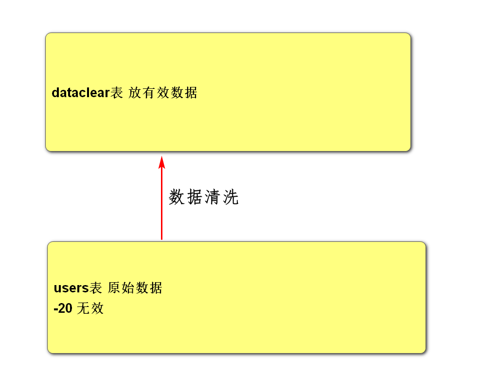

```sql
create table dataclear 
(
id bigint,
username string,
password string,
gender string,
age bigint,
city string,
created_time string
) 
row format delimited fields terminated by '|';

```


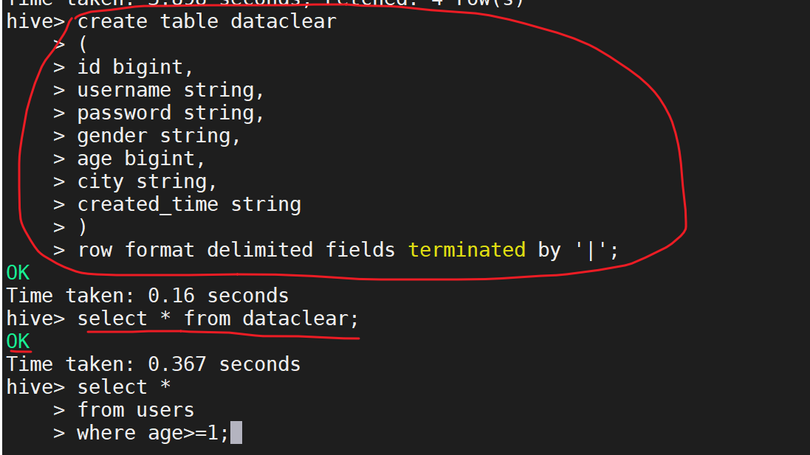

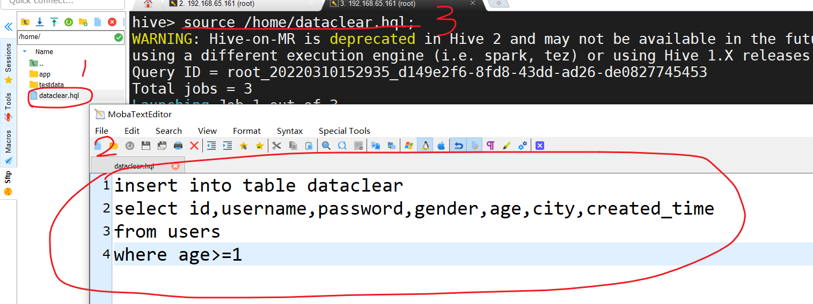

# 4，数据统计

## 4.1 按性别统计

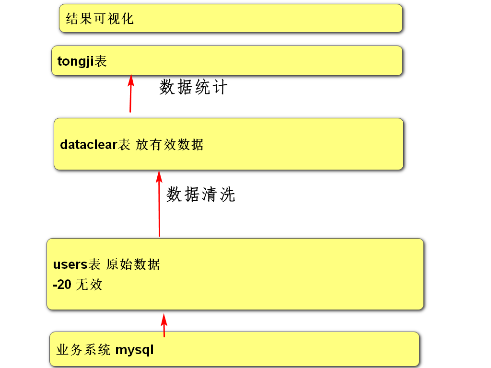

```sql
create table gender_tongji 
(
gender string,
total bigint
) 
row format delimited fields terminated by '|';

insert into table gender_tongji
    > select '男',6;

#在hive中直接执行
insert into table gender_tongji
select '男',table1.total 
from(
select count(*) as total from dataclear where gender='男'
) as table1;
    
    insert into table gender_tongji
select '女',table1.total 
from(
select count(*) as total from dataclear where gender='女'
) as table1;


```

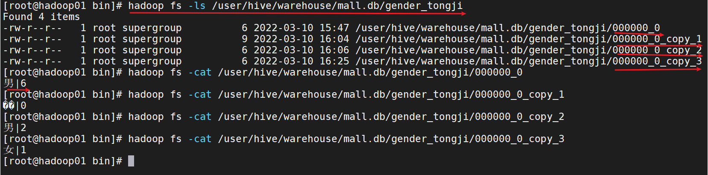

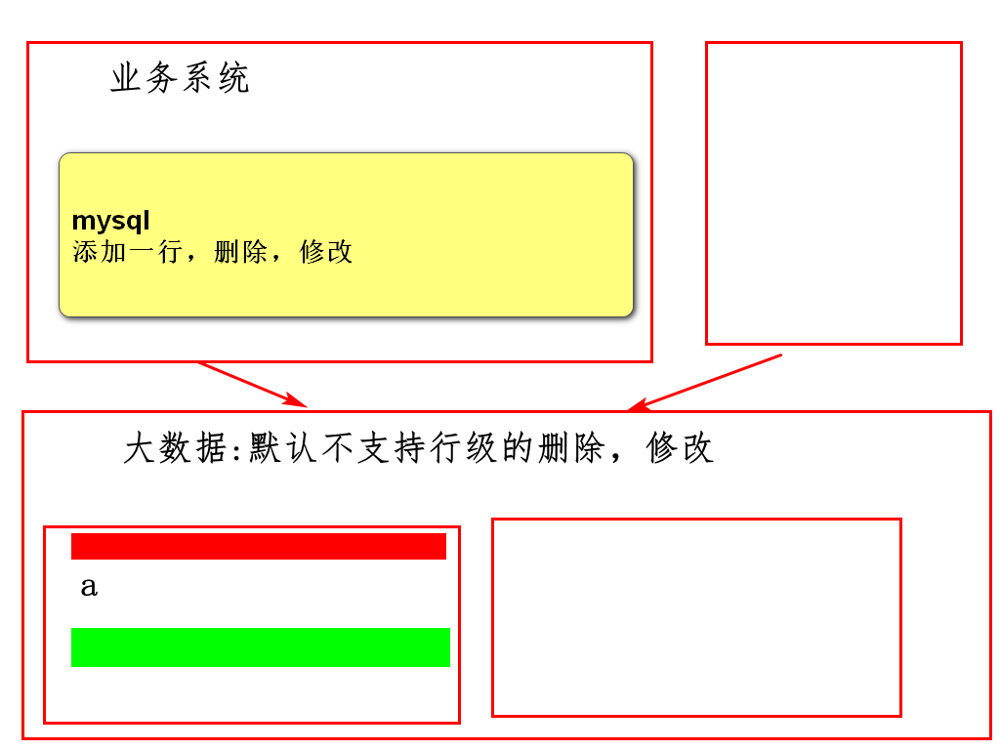

## 4.2按城市统计

```sql
create table city_tongji 
(
city string,
total bigint
) 
row format delimited fields terminated by '|';


insert into table city_tongji
select '新乡',table1.total 
from(
select count(*) as total from dataclear where city='新乡'
) as table1;


insert into table city_tongji
select '郑州',table1.total 
from(
select count(*) as total from dataclear where city='郑州'
) as table1;

```


## 4.3按时间统计

```sql
create table date_tongji 
(
register_date string,
total bigint
)
 row format delimited fields terminated by '|';
 
 
 insert into table date_tongji
select '2022-03-03',count(*) as total 
from dataclear where subString(created_time,0,10)='2022-03-03';

insert into table date_tongji
select '2022-03-04',count(*) as total from dataclear where subString(created_time,0,10)='2022-03-04';

```


# 5，数据可视化

## 5.1 把hive中的统计结果导出到mysql中

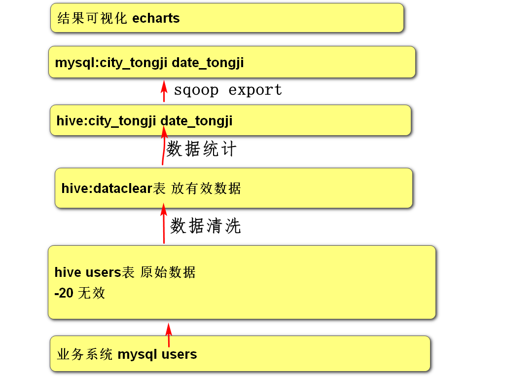

### 5.1.1在mysql中创建表

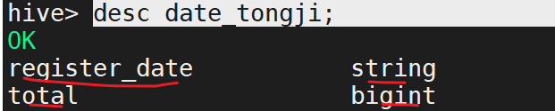

```sql
CREATE TABLE `date_tongji` (
  `register_date` varchar(256) DEFAULT NULL,
  `total` int(11) DEFAULT NULL
) ENGINE=InnoDB DEFAULT CHARSET=utf8;

```


### 5.1.2 用sqoop导出数据

```sh
cd /home/app/sqoop-1.4.4.bin__hadoop-2.0.4-alpha/bin/
ls

./sqoop export\
 --connect "jdbc:mysql://192.168.65.161:3306/mall?useUnicode=true&characterEncoding=utf-8"\
 --username root\
 --password root\
 --export-dir '/user/hive/warehouse/mall.db/date_tongji'\
 --table date_tongji\
 -m 1\
 --fields-terminated-by '|';

```


```sql
CREATE TABLE `city_tongji` (
  `city` varchar(256) DEFAULT NULL,
  `total` int(11) DEFAULT NULL
) ENGINE=InnoDB DEFAULT CHARSET=utf8;

```


```sh
./sqoop export\
 --connect "jdbc:mysql://192.168.65.161:3306/mall?useUnicode=true&characterEncoding=utf-8"\
 --username root\
 --password root\
 --export-dir '/user/hive/warehouse/mall.db/city_tongji'\
 --table city_tongji\
 -m 1\
 --fields-terminated-by '|';

```


## 5.2 echarts可视化

# 6小结


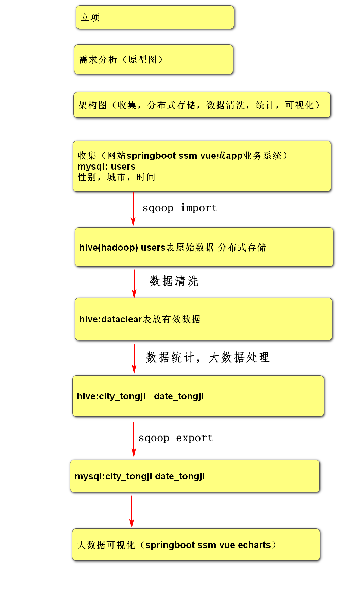

明天：做订单分析