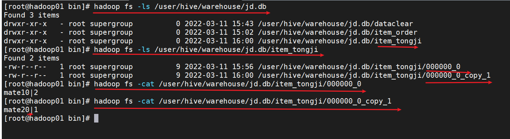

# 1，项目介绍

前面做用户分析。今天开始做订单分析


# 2，立项

项目解决了什么问题

# 3，需求分析

原型图


# 4，框架设计


# 5，数据收集


vmware中启动虚拟机

mobaxterm连上虚拟机

sqlyog连上数据库

## mysql建库 jd

```sql
CREATE DATABASE /*!32312 IF NOT EXISTS*/`jd` /*!40100 DEFAULT CHARACTER SET utf8 */;

USE `jd`;
```


## 建表

```sql
CREATE TABLE `item_order` (
  `order_id` int(11) NOT NULL AUTO_INCREMENT,
  `item_name` varchar(256) DEFAULT NULL,
  `user_id` int(11) DEFAULT NULL,
  `created_time` timestamp NOT NULL DEFAULT CURRENT_TIMESTAMP,
  PRIMARY KEY (`order_id`)
) ENGINE=InnoDB AUTO_INCREMENT=5 DEFAULT CHARSET=utf8;
```


## 用insert添加数据

```sql
insert  into `item_order`(`order_id`,`item_name`,`user_id`,`created_time`) values (1,'mate10',1,'2022-03-03 16:30:56'),
(2,'mate10',2,'2022-03-03 16:31:05'),
(3,'mate20',3,'2022-03-04 16:31:13'),
(4,'ipad',NULL,'2022-03-07 16:31:30');
```


# 6，存储

## 6.1 启动hadoop


## 6.2 在hive中创建数据库jd


## 6.3 sqoop import把数据导入到hadoop中

mobaxterm中新开一个窗口

cd sqoop

sqoop import connect username root table targit-dir

```sh
cd /home/app/sqoop-1.4.4.bin__hadoop-2.0.4-alpha/bin

ls


./sqoop import\
 --connect "jdbc:mysql://192.168.65.161:3306/jd?useUnicode=true&characterEncoding=utf-8"\
 --username root\
 --password root\
 --table item_order\
 -m 1\
 --target-dir '/user/hive/warehouse/jd.db/item_order'\
 --fields-terminated-by '|';

```

hadoop fs -ls


```sh

```


## 6.4 在hive中建表

```sql
create table item_order 
(
order_id bigint,
item_name string,
user_id bigint,
created_time string
)
row format delimited fields terminated by '|';

```


# 7，数据清洗

## 7.1创建表

```sql
create table dataclear 
(
order_id bigint,
item_name string,
user_id bigint,
created_time string
) 
row format delimited fields terminated by '|';
```


## 7.2把原始表中的有效数据导入到dataclear

```sql
insert into table dataclear 
SELECT order_id,item_name,user_id,created_time 
FROM item_order
WHERE user_id >=1;

```


# 8，数据处理

## 8.1按商品统计

建表

```sql
create table item_tongji 
(
itme_name string,
total bigint
) 
row format delimited fields terminated by '|';

```

统计

```sql
insert into table item_tongji
select 'mate10',table1.total 
from(
select count(*) as total from dataclear where item_name='mate10'
) as table1;


insert into table item_tongji
select 'mate20',table1.total 
from(
select count(*) as total from dataclear where item_name='mate20'
) as table1;

```



## 8.2按日期统计

建表

```sql
create table date_tongji 
(
order_date string,
total bigint
)
 row format delimited fields terminated by '|';

```

统计

```sql
insert into table date_tongji
select '2022-03-03',count(*) as total 
from dataclear where subString(created_time,0,10)='2022-03-03';

insert into table date_tongji
select '2022-03-04',count(*) as total from dataclear where subString(created_time,0,10)='2022-03-04';

```


# 9，可视化

## 9.1MySQL建表，

```sql
CREATE TABLE `date_tongji` (
  `order_date` varchar(256) DEFAULT NULL,
  `total` int(11) DEFAULT NULL
) ENGINE=InnoDB DEFAULT CHARSET=utf8;

```


## 9.2通过sqoop导出到mysql表

```sh
./sqoop export\
 --connect "jdbc:mysql://192.168.65.161:3306/jd?useUnicode=true&characterEncoding=utf-8"\
 --username root\
 --password root\
 --export-dir '/user/hive/warehouse/jd.db/date_tongji'\
 --table date_tongji\
 -m 1\
 --fields-terminated-by '|';

```


## 9.3可视化

springboot+ssm +echarts进行可视化

# 10，业务系统产生新数据

## 10.1 统计03-05的新数据。

## 10.2 mysql中添加新数据


## 10.3把新数据导入到hadoop中

```sh
./sqoop import\
 --connect "jdbc:mysql://192.168.65.161:3306/jd?useUnicode=true&characterEncoding=utf-8"\
 --username root\
 --password root\
 --table item_order\
 -m 1\
 --target-dir '/user/hive/warehouse/jd.db/item_order'\
 --fields-terminated-by '|'\
 --incremental append\
 --check-column order_id\
 --last-value 4;

```


## 10.4 数据清洗

```sql
insert into table dataclear 
SELECT order_id,item_name,user_id,created_time 
FROM item_order
WHERE user_id >=1 and order_id>=5;

```


## 10.5数据统计

统计的结果要放到新的统计表中

```sql
create table date_tongji05 
(
order_date string,
total bigint
)
 row format delimited fields terminated by '|';
 
 
 insert into table date_tongji05
select '2022-03-05',count(*) as total 
from dataclear where subString(created_time,0,10)='2022-03-05';


```


## 10.6 把统计结果导出到 mysql

```sh
./sqoop export\
 --connect "jdbc:mysql://192.168.65.161:3306/jd?useUnicode=true&characterEncoding=utf-8"\
 --username root\
 --password root\
 --export-dir '/user/hive/warehouse/jd.db/date_tongji05'\
 --table date_tongji\
 -m 1\
 --fields-terminated-by '|';

```


## 10.7 可视化

# 11,小结

