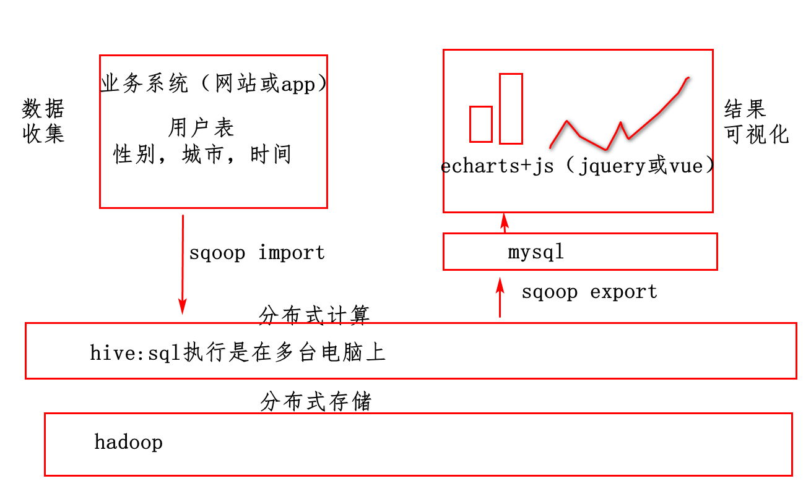
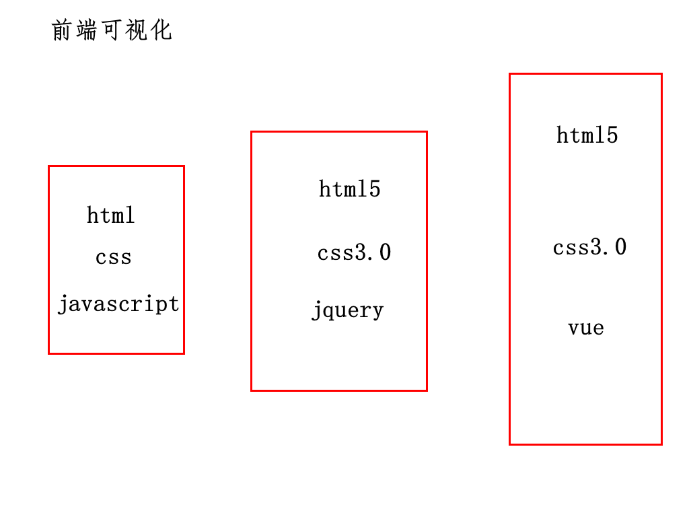
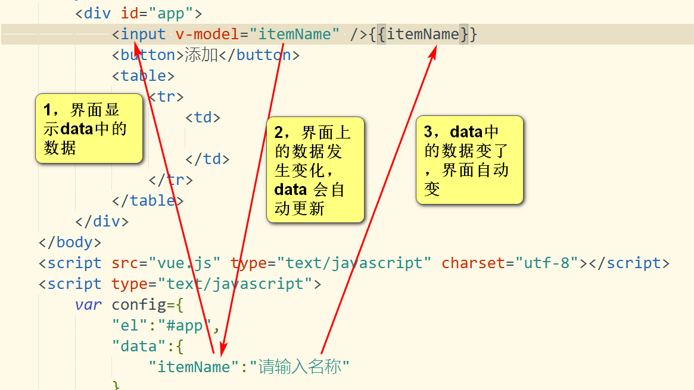

# 1，复习



# 2，本周课程安排

周三：vue,echarts

周四：服务器端springboot+springmvc+spring+mybatis

周五：服务器端和可视化整合

# 3，vue介绍



vue是前端开发框架，是一个工具

# 4，手写vue框架

## 4.1数据绑定

软件是对数据处理，进行显示

架构师写框架

TypeScript

```javascript
//定义函数，也能定义一个类
function Vue(config){
    //1,从配置对象中找到div的id
    var id=config.element
    //2,把div变成一个对象
    var object=document.getElementById(id);
    //3,从配置对象中找到数据
    var itemName=config.data;
    //4,显示
    object.innerHTML=itemName
}
```


-----------------------------------------------

程序员用框架

```html
<body>
    <div id="app">
        mate10
    </div>
</body>
<script>
    var config={
        "element":"app",
        "data":"mate10"
    }
    var vue=new Vue(config)
</script>
```

## 4.2 自动执行函数

java自动执行main方法

架构师写框架

```javascript
function Vue(config){
    //1,从配置对象中找到要自动执行的函数
    var fun=config.mounted
    //2,网页加载完运行函数
    window.onload=fun
}
```

程序员用框架

```html
<script>

//1,创建配置对象
    var config={
        "mounted":function(){
            window.alert("run")
        }
    }
    //2,启动框架
    var vue=new Vue(config)
</script>
```


# 5，用vue框架

## 5.1 数据绑定

```html
<body>
    <div id="app">
        <table>
            <tr v-for="item in itemList">
            <td>
                <!--{{}}占位符-->
                {{item}}
             </td>
            </tr>
        </table>
    </div>
    
</body>
<script src=vue.js></script>
<script>
//1,创建配置对象
    //[]数组
    var config={
        "el":"#app",
        "data":{
        "itemList":["mate10","mate20"]
    }
    }
    //2,启动框架
    var vue=new Vue(config)
</script>
```

## 5.2事件处理

```html
<body>
    <div id=app>
        <button v-on:click=login>
            登录
        </button>
    </div>
    
</body>
<script>
var config={
    "el":"#app",
    "methods":{
        "login":function(){
            
        }
    }
}
</script>
```

## 5.3小的综合案例

```html
<input v-model="itemName">
<button v-on:click="insert">添加</button>
<table>
    <tr v-for=>
    <td></td>
    </tr>
</table>
<script>
var config={
    "el":"",
    "data":{
        "itemName":"请输入商品名称",
        "itemList":[]
    },
    "methods":{
        "insert":function(){
            window.alert(this.itemName)
        }
    }
}
</script>
```



双向数据绑定

# 6,echarts

echarts是前端(网页)图表框架