# 1，复习

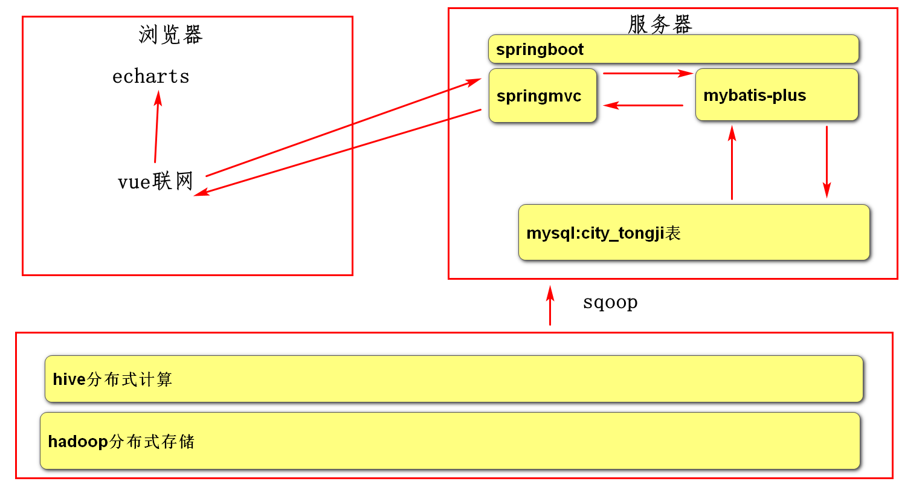

# 2，maven

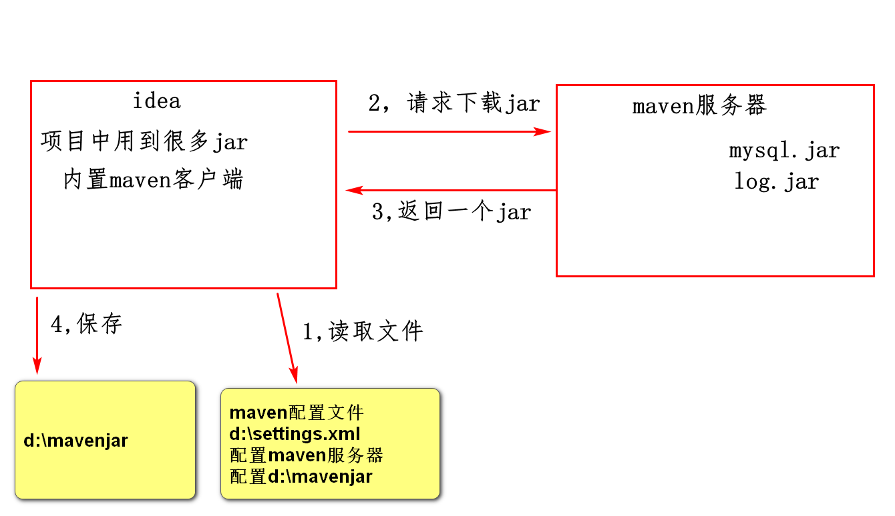

maven使用步骤

1，d盘创建文件夹mavenjar

2,拷贝settings.xml到d:

3,修改setting.xml

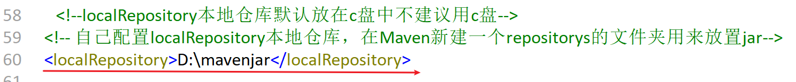

# 3,使用springboot创建服务器端程序

spring:是用来整合springmvc,mybatis-plus，写很多xml

springboot是spring升级，整合springmvc,mybatis-plus不用写xml,内置了tomcat

## 3.1 在idea中配置maven

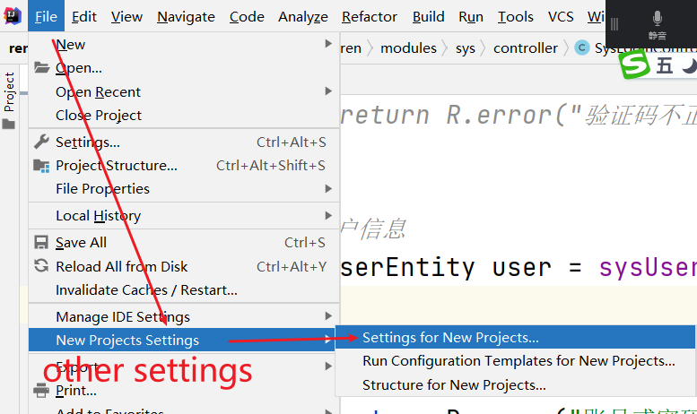

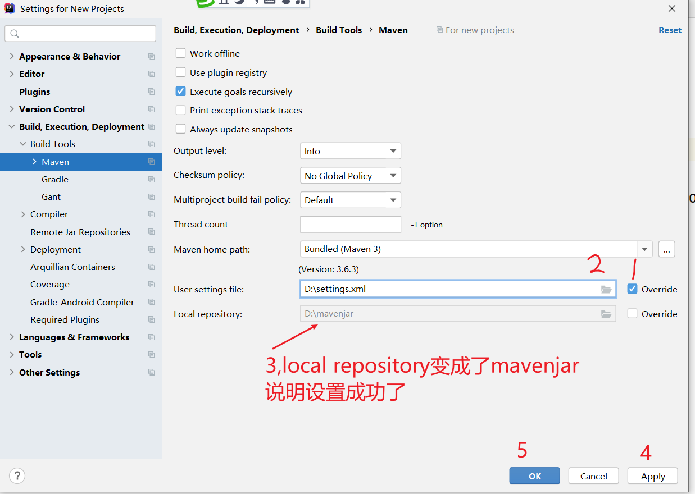

## 3.2 创建springboot项目

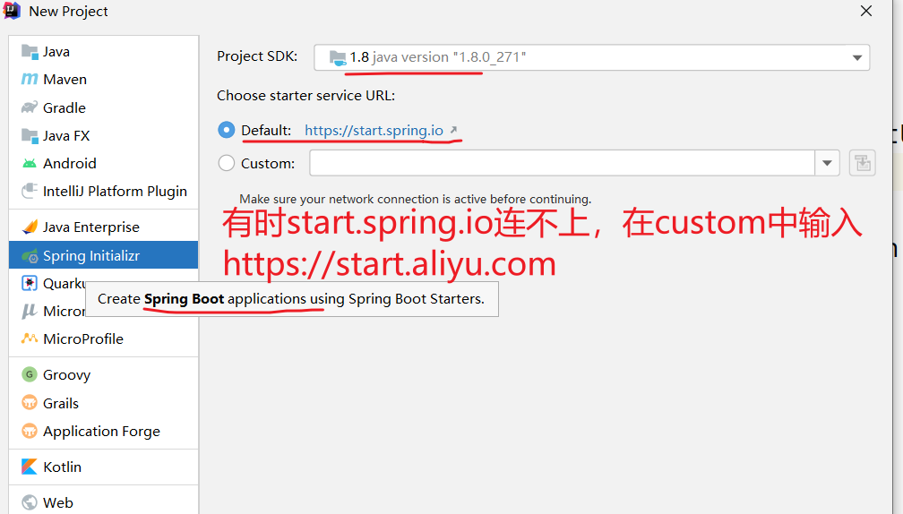

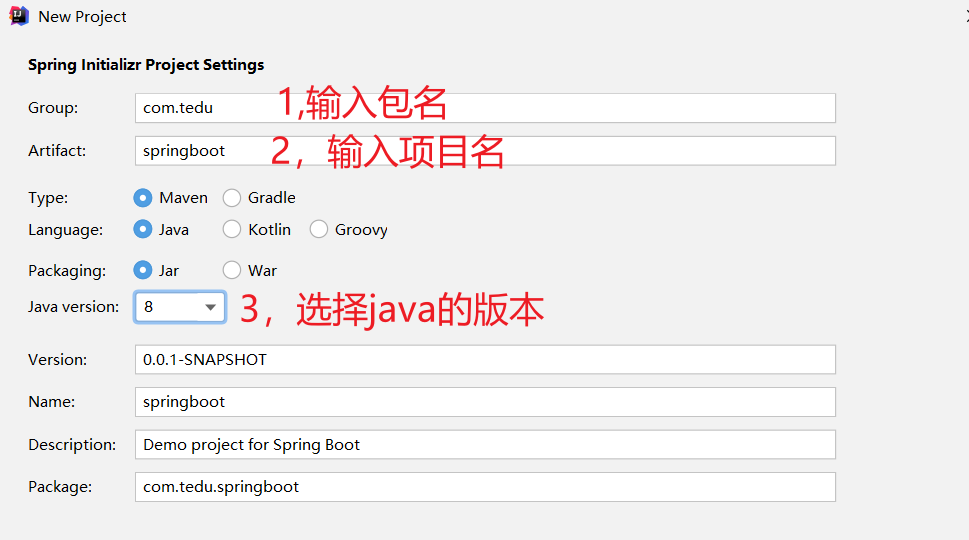

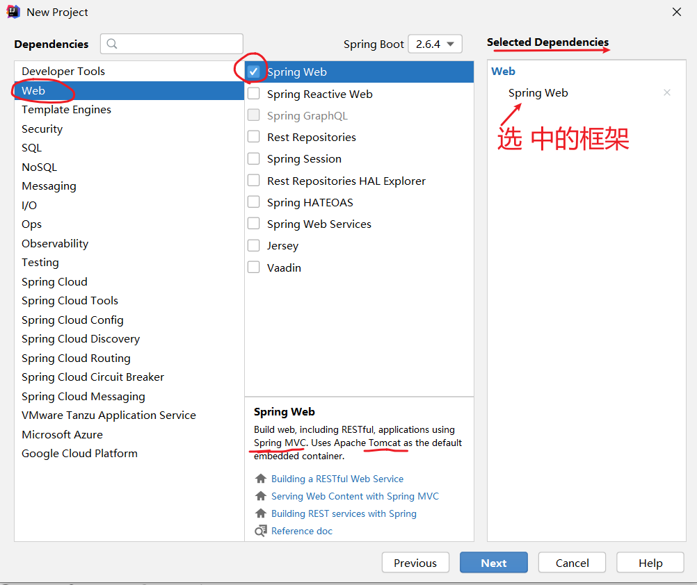

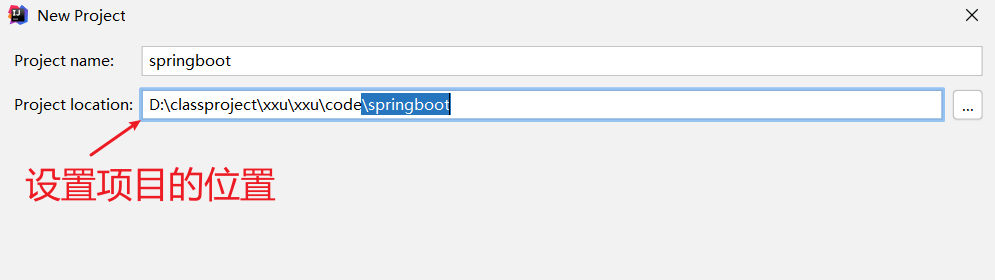

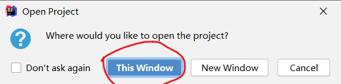

本地仓库d:\mavenjar中有文件夹，说明maven配置成功了

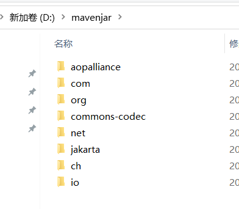

## 3.3 写一个服务器端程序

创建controllor包，contollor控制

创建类

```java
@RestController//告诉框架为类创建一个对象
class CityTongjiController{
    //在浏览器中输入http://localhost:8080/test
    @RequestMappig("/test")
    public String test(){
        return "大数据统计结果"
    }
}
```

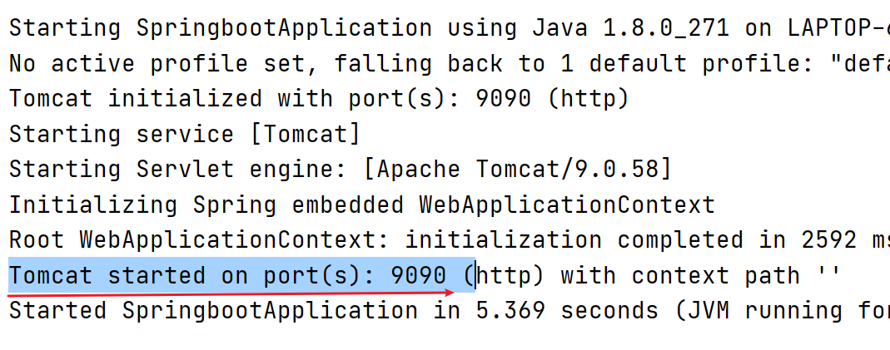

# 4,访问数据库

访问数据库用mybatis

讲mybatis-plus

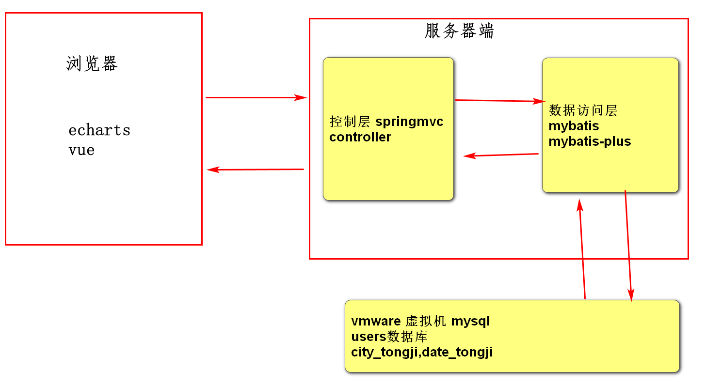

## 4.1测试数据库

启动vmware

启动sqlyoug,连上了

select * from city_tongji

## 4.2创建项目

1,选择项目类型

2，输入包名，项目名

3，添加spring web,mysql依赖

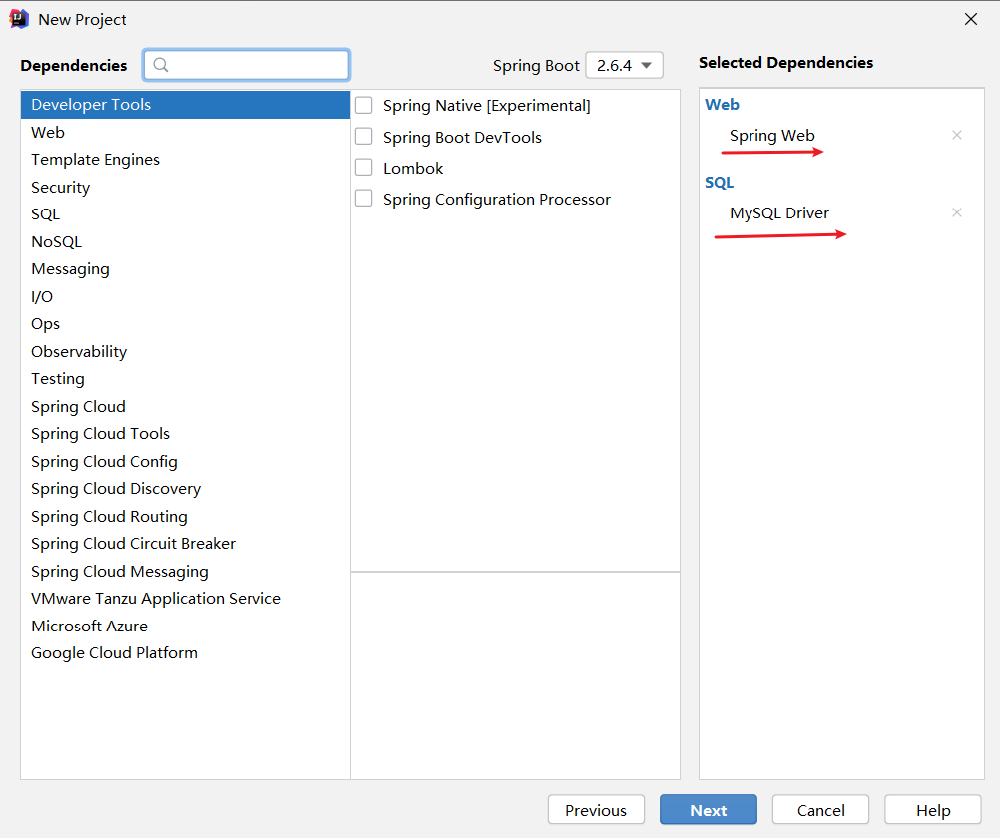

4，在pom.xml中添加mybatis-plus依赖

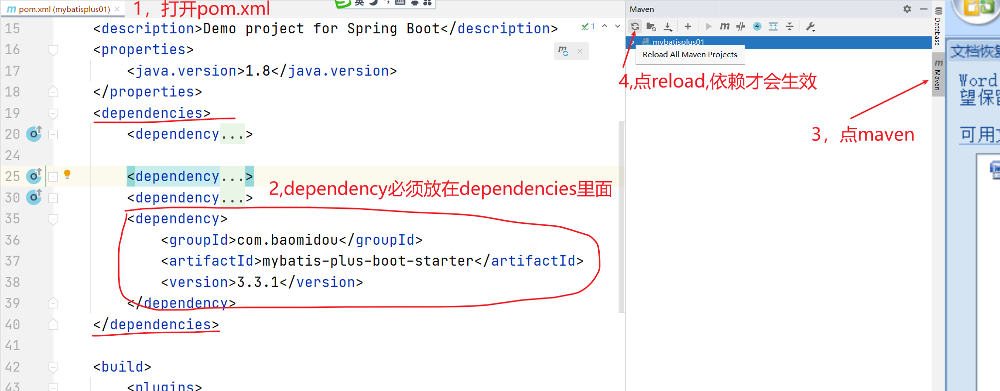

5，启动报错

mybatis-plus要到application.yml中读取url属性中的数据库名

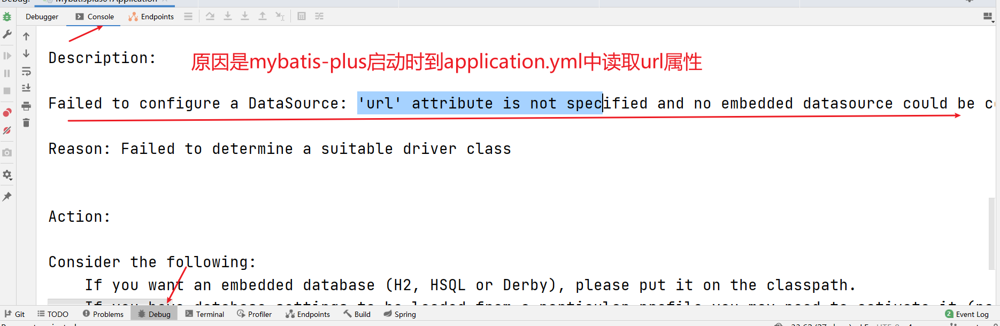

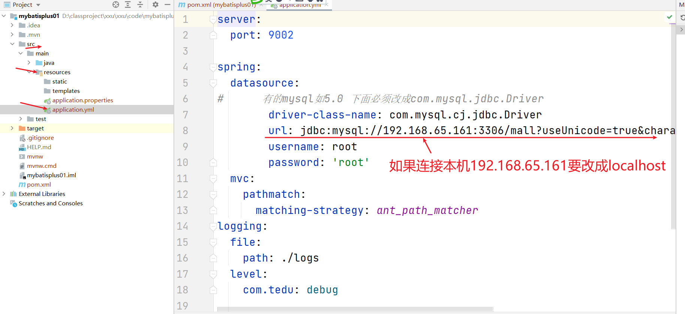

## 4.3创建控制层

## 4.4编写数据访问层

### 4.4.1 分析

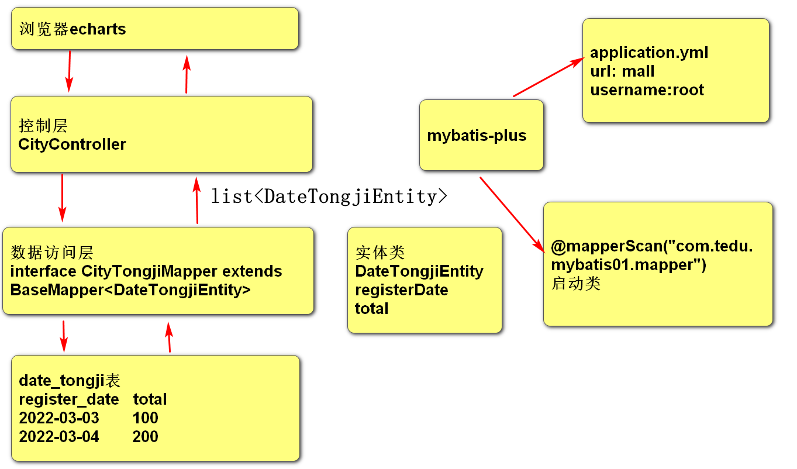

### 4.4.2设计

```java
package com.tedu.mybatis01.pojo
    //实体类
    class DateTongjiEntity{
        Strring registerDate//表中的register_date列
        Integer total//表中total列
    }

//数据访问层
com.teud.mybatis01.mapper
    interface DateTongjiMapper extends BaseMapper<DateTongjiEntity>{
    
}

//接口的实现类是由mybatis生成
@mapperScan("com.teud.mybatis01.mapper")
    public class Mybatisplus01Application{}
//控制层
class CityController{
    //得到数据访问层的对象
    @autowired//自动注入，从框架中取一个对象
    DateTongjiMapper dateTongjiMapper
        
    public list<DateTongjiEntity> getDateTongji(){
        调用数据访问层
    }
}
```


### 4.4.3实现

### 4.4.4测试

# 5，小结

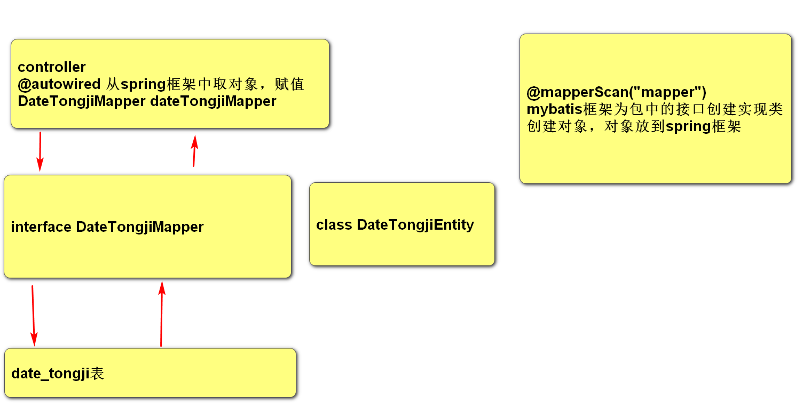