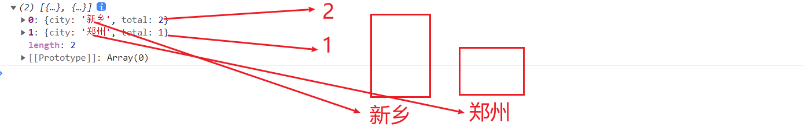

# 1，复习


# 2，城市统计的可视化

## 2.1需求

把大数据平台城市统计的结果显示在浏览器上

## 2.2分析


## 2.3设计

1，启动vmware

2,创建项目，添加springweb,mysql driver两个依赖

3，在pom.xml中添加mybatis-plus依赖

4，启动报错，在application.yml中配置url


5,实体类

```java
com.tedu.mybatis02
            pojo
            mapper
            controller

package com.tedu.mybatis02.pojo
    @TableName("city_tongji")
    class CityTongjiEntity{
        @TableField("city")
        String city
            
         @TableField("total")
         Integer total
         
            getter(),setter()
    }
```

6，数据访问层

```java
package com.tedu.mybatis02.mapper
@Mapper
interface CityTongjiMapper extends BaseMapper<CityTongjiEntity>{
    
}

@MappeScan(com.tedu.mybatis02.mapper)
Mybatis02Applciation
```

7，控制层

```java
package com.tedu.mybatis02.controller
    @RestController
    class CityController{
        //从spring框架中取对象
        @autowired
        CityTongjiMapper cityTongjiMapper
            
            @RequestMapping("/getCity")
         public list<CityTongjiEntity> getCity(){
            
        }
        
    }
```

8，在浏览器中直接访问

9，在html文件中用vue+axios联网框架取服务器端数据


```html
<body>
    <div id=app>
        
    </div>
</body>
<script src=vue.js></script>
<script src=axios.min.js></script>
<script>
var config={
    "el":"#app",
    "mounted":function(){
        window.alert("联网取大数据统计结果")
    }
}
var vue=new Vue(config)
</script>
```


做前端开发有跨域问题

什么是跨域，www,baidu.com访问www.alipay.com

浏览器为了安全，不允许A网站访问B网站

解决方法是在服务器controller上加@crossOrigin

```java
//控制层
@RestController
@CrossOrigin//允许任何网站访问我，服务器必须重启
public class CityController {
    
}
```


10，用echarts显示数据



## 2.4实现

## 2.5总结


# 3，日期统计的可视化

下周三讲。