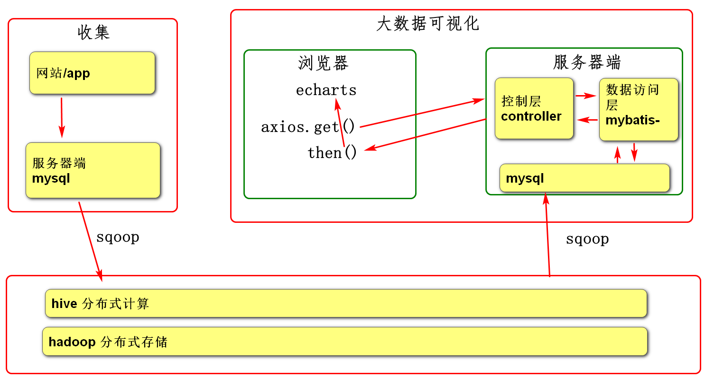
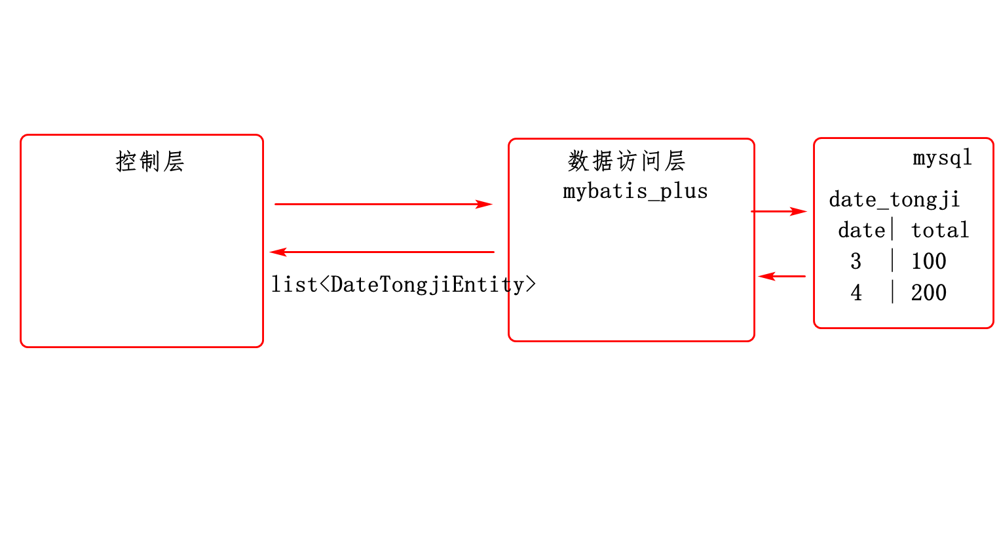
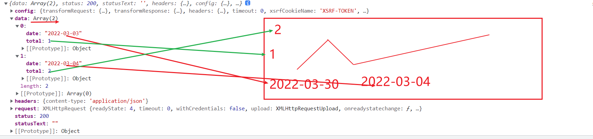
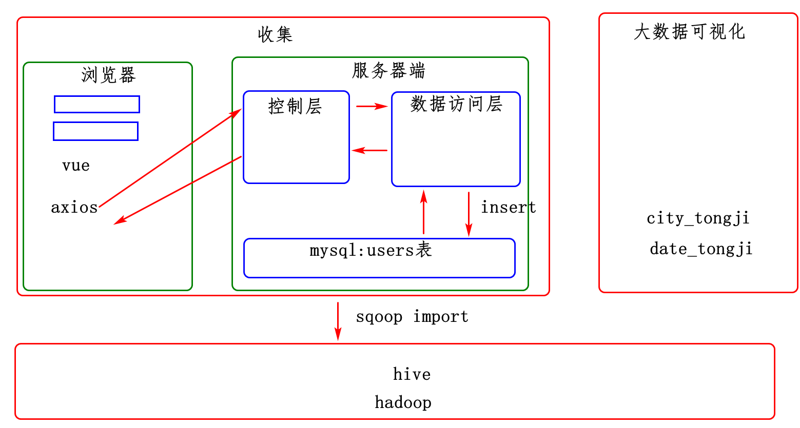

# 1，复习



# 2，本周安排

周三：1，2大数据可视化，3，4数据收集，收集用户信息

周四：收集订单

周五：论文内容指导，画类图，画时序图，画框架图

# 3，用户日期统计可视化

## 3.1环境准备

vmware

sqlyog mall库 date_tongji表

## 3.2服务器端

### 3.2.1 需求

读date_tongji表，把数据返回给浏览器

### 3.2.2框架分析



### 3.2.3设计

1，创建项目，添加spring web,mybatis driver依赖

2，打开pom.xml添加mybatis-plus依赖，拷贝application.yml

3,创建pojo,mapper,controller包

4，创建实体类

```java
@tableName("date_tongji")
class DateTongjiEntity{
    @tableField("date")
   String Date //date列
       @TableField("total")
   Interger total //total列
       getter(),setter()
}
```

5，创建数据访问层

```java
package com.tedu.mybatis03.mapper
    @Mapper
    interface DateTongjiMapper extends BaseMapper<DateTongjiEntity>{
    
}
```

6,创建控制层

```java
@RestController
class DateController{
    
    @RequestMappin("/getDate")
    // http://localhost:9002/getDate
    List<DateTongjiEntity> getDate()
}
```


7,前端可视化

```html
<body>
    <div id="app">
        <div id="main">
            
        </div>
    </div>
</body>
<script src=vue.js></script>
<script src=axios.min.js></script>
<script src=echarts.js></script>
<script>
var config={
    "el":"#app",
    "mounted":function(){
        var serverUrl="http://localhost:9002/getDate"
        
        axios.get(serverUrl)
            .then(function(response){
            console.log(response)
            用echarts显示大数据分析结果
        })
            .catch(function(e){
            console.log("联网失败")
            console.log(e)
        });
    }
}

var vue=new Vue(config)
</script>
```





### 3.2.4实现

### 3.2.5测试


## 3.3前端可视化

# 4，用户数据收集

## 4.1 需求

收集用户信息，先放在业务系统中

## 4.2分析



## 4.3设计

4.3.1表结构

4.3.2实体类

4.3.3数据访问层

4.3.4控制层

4.3.5前端开发

```html
<body>
    <div id=app>
        <input v-model="username">
        <input v-model="password">
        <input v-model="gender">
        <input v-model="age">
        <input v-model="city">
<button v-on:click="register">
    注册
        </button>

    </div>
</body>
<scrpt src=vue.js></scrpt>
<scrpt src=axios.min.js></scrpt>
<script>
var config={
    "el":"#app",
    "data":{
        "username":""
    },
    "methods":{
        "register":function(){
            axios.get().then().catch()
        }
    }
}
var vue=new Vue(config)
</script>
```


## 4.4实现

## 4.5测试