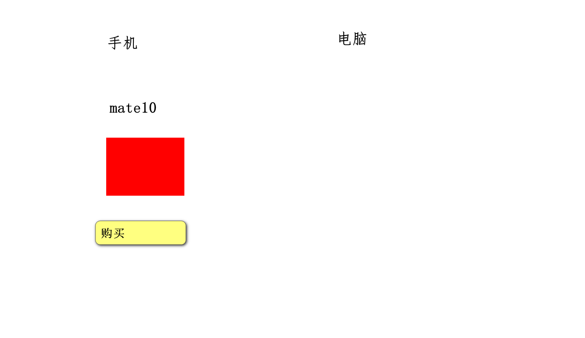
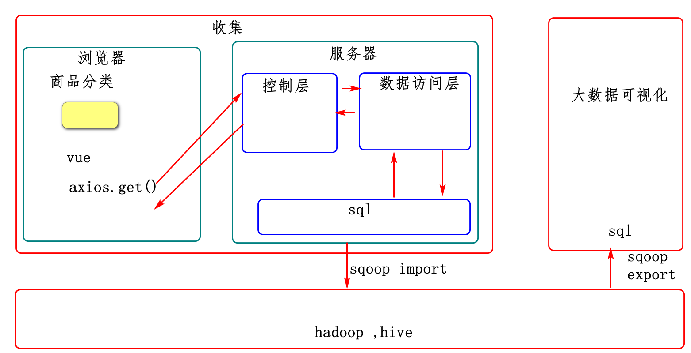
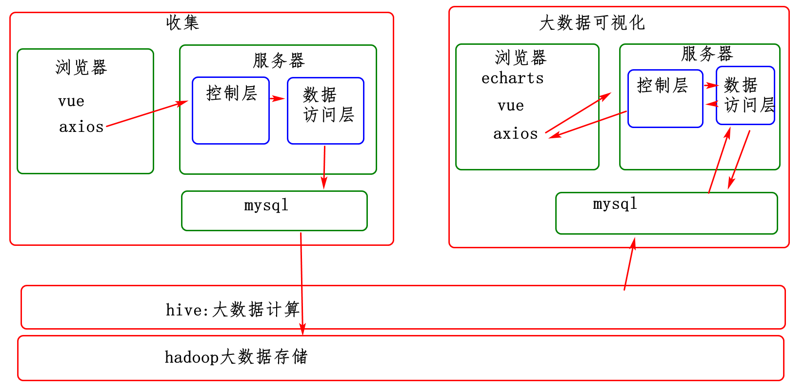

# 订单收集

# 1，需求

# 2，架构分析

# 3，设计

## 3.1表的设计

vmware,sqlyog

创建商品分类表,商品表，订单表

## 3.2服务器端开发

### 3.2.1商品分类

1，实体类

2，数据访问层

3，控制层

### 3.2.2商品

1，实体类

2，数据访问访问层

3，控制层

### 3.2.3增加订单

1，实体类

2，数据访问访问层

3，控制层

## 3.3浏览器前端开发

# 4，实现

# 5，测试

# 6，总结

