# 1，论文内容辅导

项目做出来

有流程：立项，需求，框架分析，实现，测试

## 1.1需求

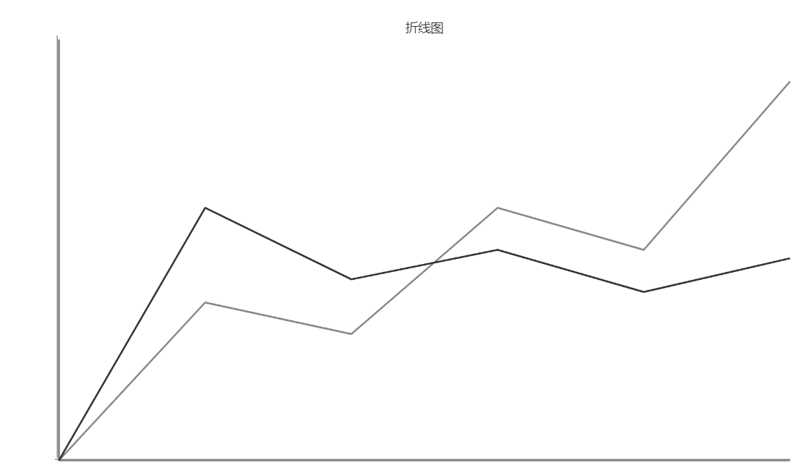

## 1.2框架图

### 1.2.1 项目架构

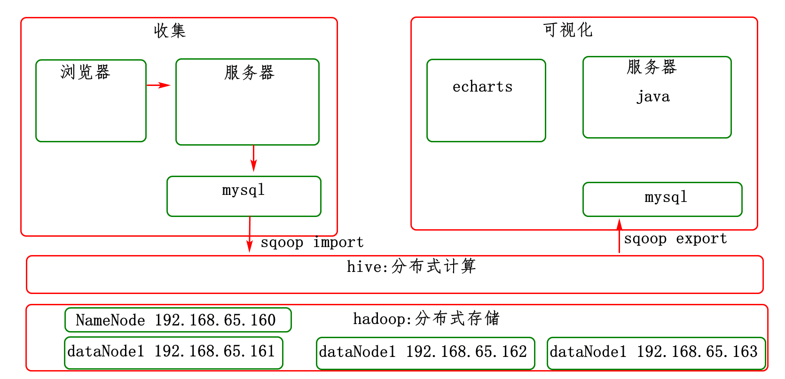

### 1.2.2可视化架构

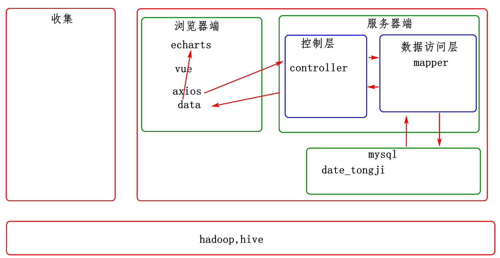

### 1.2.3 收集架构

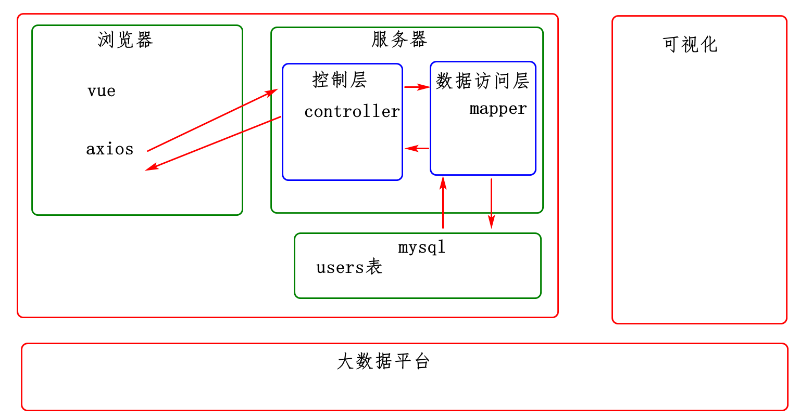

# 2，画类图，时序图

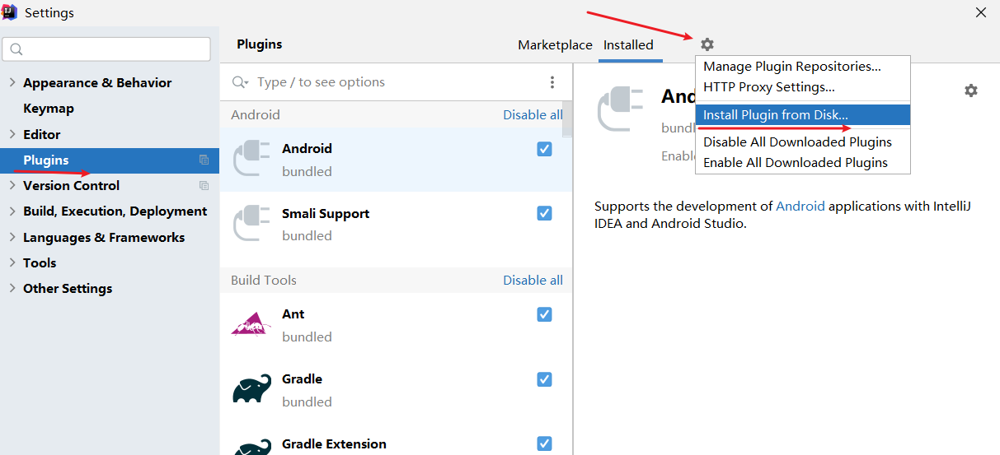


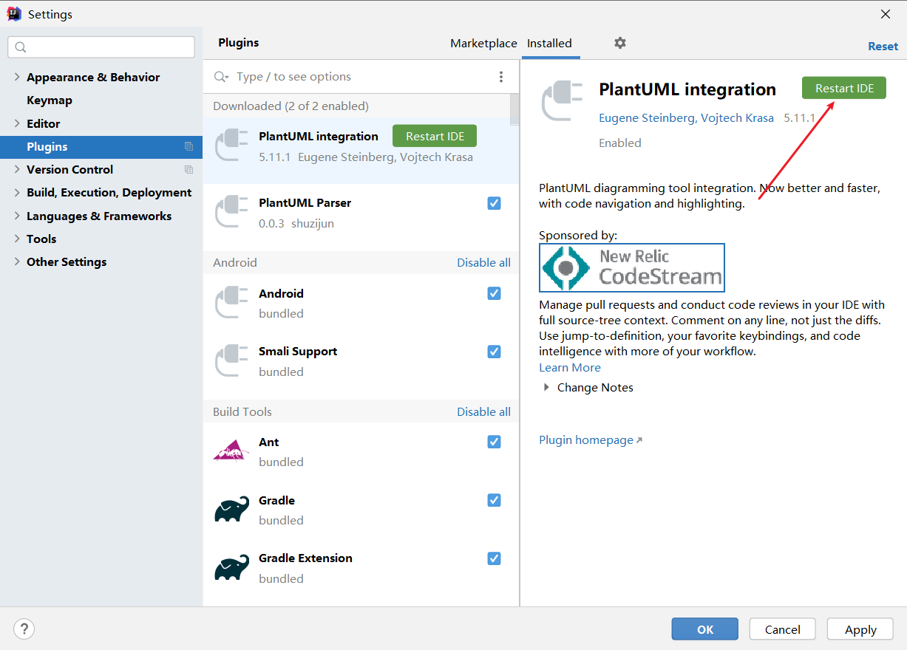


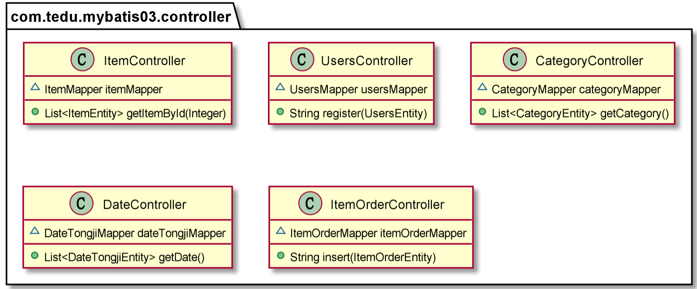


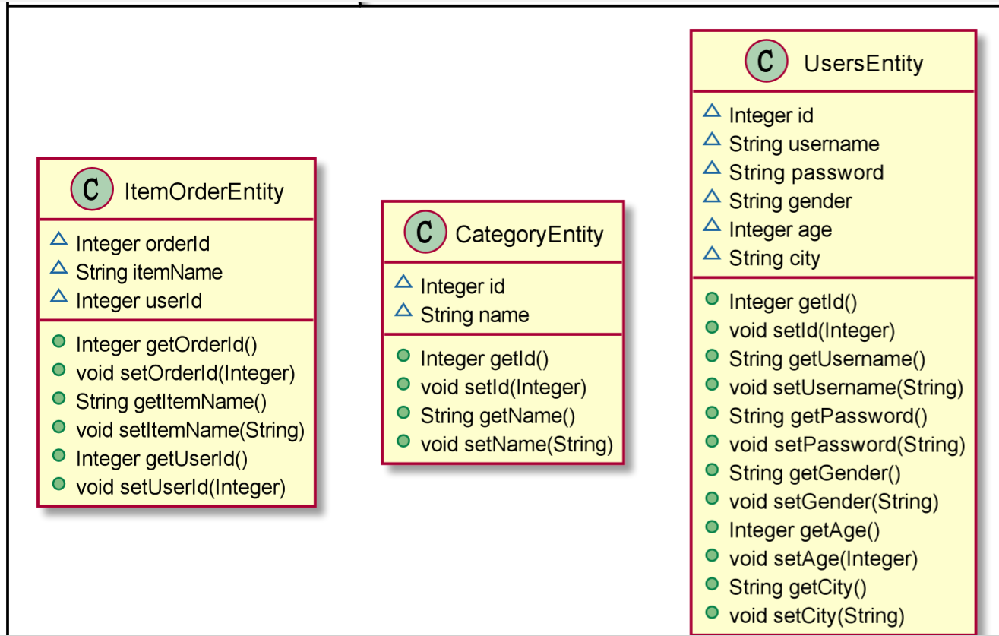


## 2.2生成时序图

### 2.2.1 安装plugin

file-->settings

### 2.2.2 使用plugin生成时序图

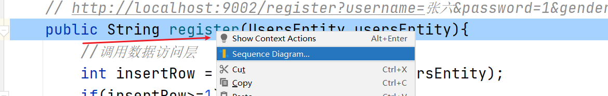

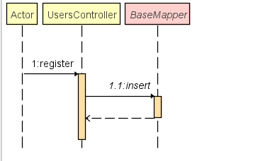


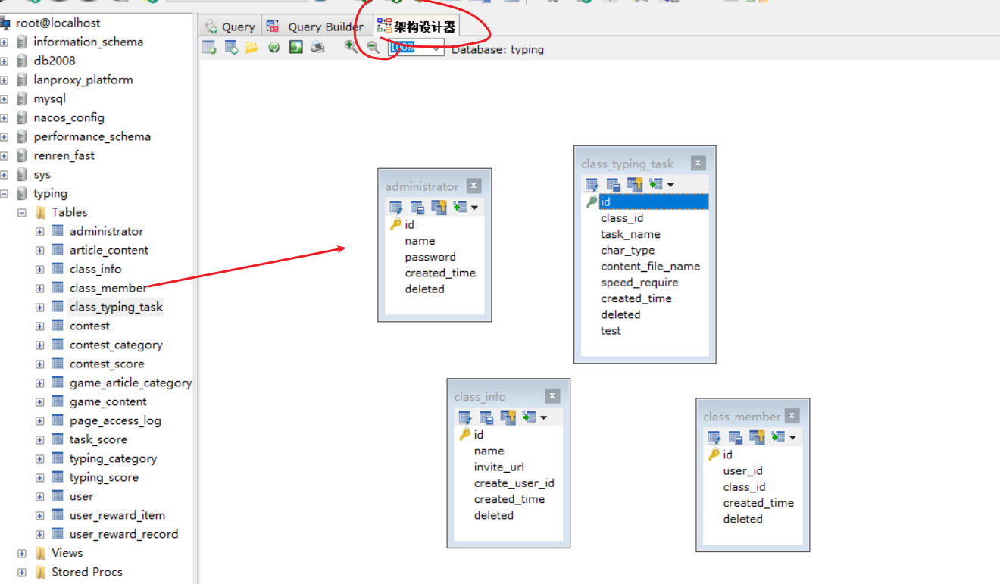


# 3，收集，存储，清洗，处理，可视化

## 3.1 环境准备

### 3.1.1收集系统

vmware,sqlyog

### 3.1.2大数据平台

mobax

start-all.sh启动hadoop

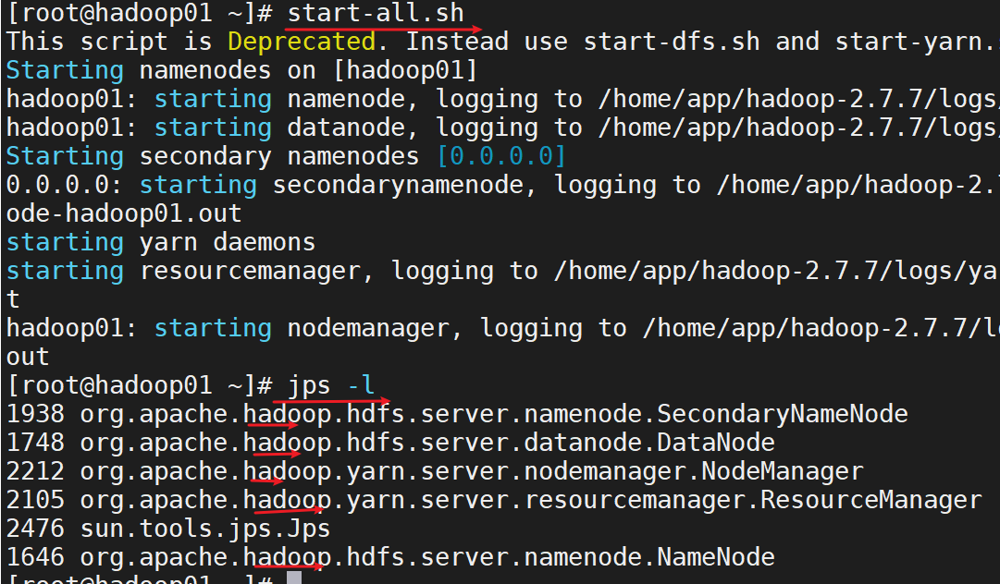

./hive运行hive

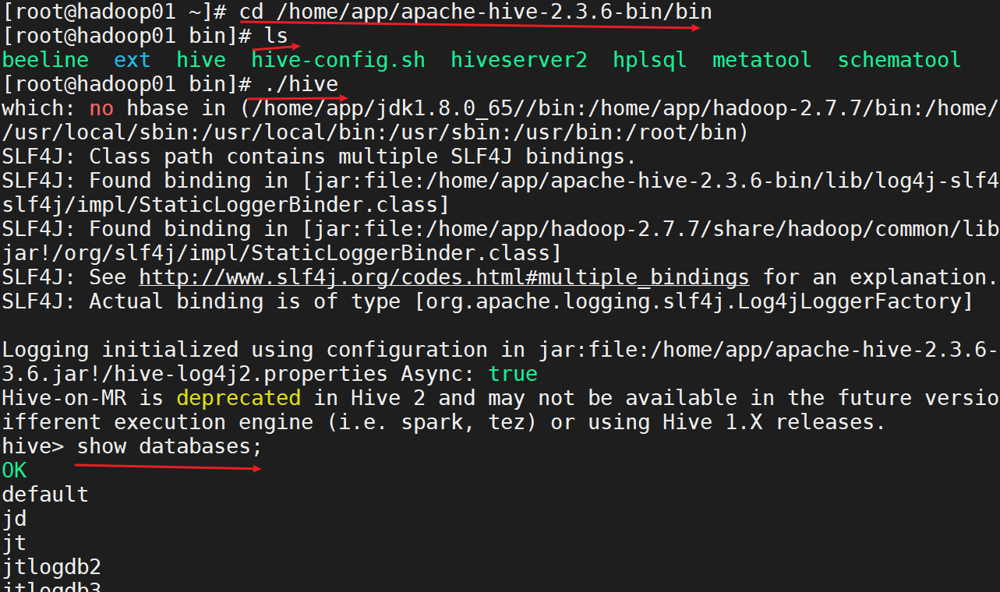

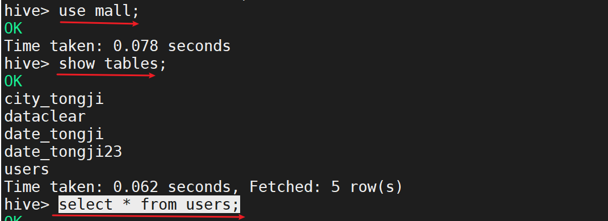

### 3.1.2可视化平台

## 3.2 收集新的数据

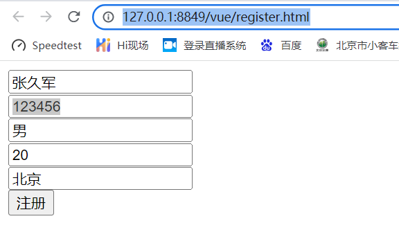

## 3.3导入到大数据平台

cd /home/app/apache-sqoop/bin

sqoop import

mysql

target /user/hive/warehouse/mall.db/users

条件 id>9

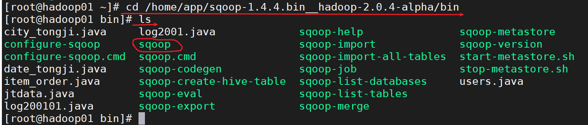

```sh
./sqoop import\
 --connect "jdbc:mysql://192.168.65.161:3306/mall?useUnicode=true&characterEncoding=utf-8"\
 --username root\
 --password root\
 --table users\
 -m 1\
 --target-dir '/user/hive/warehouse/mall.db/users'\
 --fields-terminated-by '|'\
 --incremental append\
 --check-column id\
 --last-value 9;

```


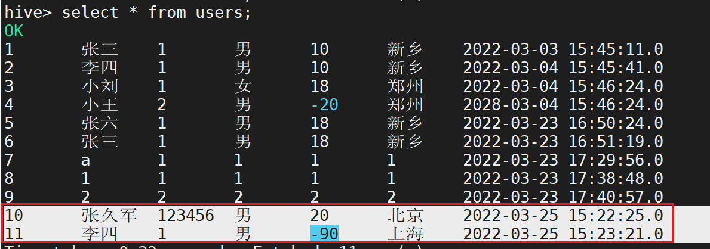


## 3.4 数据清洗

```sql
insert into table dataclear 
select id,username,password,gender,age,city,created_time 
from users  
where age>=1 and id>=10;

```


## 3.5数据统计

```sql
create table date_tongji25 
(
register_date string,
total bigint
)
 row format delimited fields terminated by '|';
 
 
 
 insert into table date_tongji25
select '2022-03-25',count(*) as total 
from dataclear where subString(created_time,0,10)='2022-03-25';


```


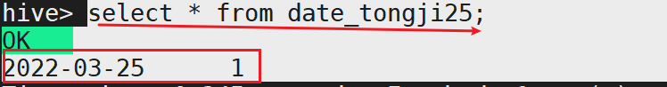


## 3.6把统计结果导出到可视化平台

```sh
./sqoop export\
 --connect "jdbc:mysql://192.168.65.161:3306/mall?useUnicode=true&characterEncoding=utf-8"\
 --username root\
 --password root\
 --export-dir '/user/hive/warehouse/mall.db/date_tongji25'\
 --table date_tongji\
 -m 1\
 --fields-terminated-by '|';

```


## 3.7查看统计结果

# 4,联系方式

微信 13691481018